# Polyglot Codebase Knowledge Graph

> Generated offline by **readmenator**. 7 files, 419 symbols, 127 imports. Supports C, C++, Python, Go, Rust, JS/TS, Java, C#, Shell, PHP, Dart, GDScript, Nim, ASM, Ruby, Swift, Kotlin, Scala, Lua, Elixir.
> No LLMs. No tokens. Pure static analysis. See more [here](https://github.com/grisuno/ReadMenator)

**Start here:** Statistics Dashboard for scope, God Nodes for blast radius, Architecture Reference for per-file API. Agents: prefer `readmenator-agent/INDEX.md` + `SYMBOLS.md`.

**Total Files Parsed:** 7 | **Total Symbols Extracted:** 419 | **Total Imports:** 127

<!-- ranking_model: v1.0 | weights: {ppr:0.45,auth:0.2,test:0.15,doc:0.1,fresh:0.1} | alpha:0.85 | commit:b3ca3bb | date:2026-07-18 -->


## Table of Contents

1. [Statistics Dashboard](#statistics-dashboard)
2. [Architectural Layers](#architectural-layers)
3. [Ranked Context](#ranked-context)
4. [God Nodes](#god-nodes)
5. [Suggested Questions](#suggested-questions)
6. [Taint Propagation Map](#taint-propagation-map)
7. [Hotspot Analysis](#hotspot-analysis)
8. [Change Impact Analysis](#change-impact-analysis)
9. [Suggested Linting Rules](#suggested-linting-rules)
10. [Orphans](#orphans)
11. [Query Recipes](#query-recipes)
12. [Structural Knowledge Map](#structural-knowledge-map)
13. [UML Class Diagram](#uml-class-diagram)
14. [Code Property Graph](#code-property-graph)
15. [Architecture Reference](#architecture-reference)
    - [PY (6 files)](#py-6-files)
    - [SH (1 files)](#sh-1-files)

---

## Statistics Dashboard

| Metric | Value |
|--------|-------|
| Total Files | 7 |
| Total Symbols | 419 |
| Total Imports | 127 |
| Call Edges | 7060 |
| Inheritance Edges | 38 |
| Languages | 2 |
| Avg Symbols/File | 59.9 |
| Avg Imports/File | 18.1 |

### Top Files by Import Count (Fan-Out)

| File | Imports | Symbols | Language |
|------|---------|---------|----------|
| `neurologos_tricameral_loss5.4.py` | 33 | 103 | py |
| `neurologos_tricameral_loss8.0.py` | 33 | 95 | py |
| `neurologos_tricameral_loss2.7.py` | 30 | 100 | py |
| `neurologos_tricameral_loss3.9.py` | 16 | 70 | py |
| `neurologos_tricameral_loss4.5.py` | 15 | 51 | py |

---

## Architectural Layers

Auto-detected from path patterns, naming conventions, and imported frameworks.

| Layer | Files |
|-------|-------|
| utility | 7 |

### utility

- `app.py` (py, 0 symbols)
- `install.sh` (sh, 0 symbols)
- `neurologos_tricameral_loss2.7.py` (py, 100 symbols)
- `neurologos_tricameral_loss3.9.py` (py, 70 symbols)
- `neurologos_tricameral_loss4.5.py` (py, 51 symbols)
- `neurologos_tricameral_loss5.4.py` (py, 103 symbols)
- `neurologos_tricameral_loss8.0.py` (py, 95 symbols)

---

## Ranked Context

Files ranked by composite score for the current query context. The ranking combines Personalized PageRank (query relevance), global authority, test coverage, documentation coverage, and code freshness. Model: v1.0.

| Rank | File | Composite | PPR | Authority | Test | Doc |
|------|------|-----------|-----|-----------|------|-----|
| 1 | `app.py` | 0.1000 | 0.0000 | 0.0000 | 0.00 | 1.00 |
| 2 | `neurologos_tricameral_loss3.9.py` | 0.0414 | 0.0000 | 0.0000 | 0.00 | 0.41 |
| 3 | `neurologos_tricameral_loss8.0.py` | 0.0368 | 0.0000 | 0.0000 | 0.00 | 0.37 |
| 4 | `neurologos_tricameral_loss5.4.py` | 0.0340 | 0.0000 | 0.0000 | 0.00 | 0.34 |
| 5 | `neurologos_tricameral_loss2.7.py` | 0.0230 | 0.0000 | 0.0000 | 0.00 | 0.23 |
| 6 | `neurologos_tricameral_loss4.5.py` | 0.0216 | 0.0000 | 0.0000 | 0.00 | 0.22 |
| 7 | `install.sh` | 0.0000 | 0.0000 | 0.0000 | 0.00 | 0.00 |

---

## God Nodes

Most architecturally central files ranked by combined import/export degree and symbol richness.

| File | Score | Connections | PageRank |
|------|-------|-------------|----------|
| `neurologos_tricameral_loss5.4.py` | 10.3 | | 0.0000 |
| `neurologos_tricameral_loss2.7.py` | 10.0 | | 0.0000 |
| `neurologos_tricameral_loss8.0.py` | 9.5 | | 0.0000 |
| `neurologos_tricameral_loss3.9.py` | 7.0 | | 0.0000 |
| `neurologos_tricameral_loss4.5.py` | 5.1 | | 0.0000 |
| `app.py` | 0.0 | | 0.0000 |
| `install.sh` | 0.0 | | 0.0000 |

---

## Suggested Questions

Auto-generated exploration prompts based on graph structure:

- What does neurologos_tricameral_loss5.4.py depend on, and what depends on it? (0 connections)
- What does neurologos_tricameral_loss2.7.py depend on, and what depends on it? (0 connections)
- What does neurologos_tricameral_loss8.0.py depend on, and what depends on it? (0 connections)
- What is HierarchicalEpisodicMemory in neurologos_tricameral_loss2.7.py and how is it used?
- What is NeurocognitiveSystem in neurologos_tricameral_loss3.9.py and how is it used?

---

## Taint Propagation Map

Taint analysis traces how dangerous imports propagate through the codebase via transitive dependencies. Source files import dangerous modules directly; sink files receive the danger indirectly.

**Taint Sources:** 5 | **Taint Sinks:** 5 | **Propagation Paths:** 14

- `neurologos_tricameral_loss2.7.py` imports `subprocess` (0 hop to `neurologos_tricameral_loss2.7.py`) [high]
  Path: neurologos_tricameral_loss2.7.py
- `neurologos_tricameral_loss2.7.py` imports `urllib.request` (0 hop to `neurologos_tricameral_loss2.7.py`) [medium]
  Path: neurologos_tricameral_loss2.7.py
- `neurologos_tricameral_loss2.7.py` imports `urllib.request` (0 hop to `neurologos_tricameral_loss2.7.py`) [medium]
  Path: neurologos_tricameral_loss2.7.py
- `neurologos_tricameral_loss2.7.py` imports `urllib.request` (0 hop to `neurologos_tricameral_loss2.7.py`) [medium]
  Path: neurologos_tricameral_loss2.7.py
- `neurologos_tricameral_loss3.9.py` imports `urllib.request` (0 hop to `neurologos_tricameral_loss3.9.py`) [medium]
  Path: neurologos_tricameral_loss3.9.py
- `neurologos_tricameral_loss4.5.py` imports `urllib.request` (0 hop to `neurologos_tricameral_loss4.5.py`) [medium]
  Path: neurologos_tricameral_loss4.5.py
- `neurologos_tricameral_loss5.4.py` imports `subprocess` (0 hop to `neurologos_tricameral_loss5.4.py`) [high]
  Path: neurologos_tricameral_loss5.4.py
- `neurologos_tricameral_loss5.4.py` imports `urllib.request` (0 hop to `neurologos_tricameral_loss5.4.py`) [medium]
  Path: neurologos_tricameral_loss5.4.py
- `neurologos_tricameral_loss5.4.py` imports `urllib.request` (0 hop to `neurologos_tricameral_loss5.4.py`) [medium]
  Path: neurologos_tricameral_loss5.4.py
- `neurologos_tricameral_loss5.4.py` imports `urllib.request` (0 hop to `neurologos_tricameral_loss5.4.py`) [medium]
  Path: neurologos_tricameral_loss5.4.py
- `neurologos_tricameral_loss8.0.py` imports `subprocess` (0 hop to `neurologos_tricameral_loss8.0.py`) [high]
  Path: neurologos_tricameral_loss8.0.py
- `neurologos_tricameral_loss8.0.py` imports `urllib.request` (0 hop to `neurologos_tricameral_loss8.0.py`) [medium]
  Path: neurologos_tricameral_loss8.0.py
- `neurologos_tricameral_loss8.0.py` imports `urllib.request` (0 hop to `neurologos_tricameral_loss8.0.py`) [medium]
  Path: neurologos_tricameral_loss8.0.py
- `neurologos_tricameral_loss8.0.py` imports `urllib.request` (0 hop to `neurologos_tricameral_loss8.0.py`) [medium]
  Path: neurologos_tricameral_loss8.0.py

---

## Hotspot Analysis

Files ranked by combined complexity (symbol count) and centrality (connection count). High-scoring files are architecturally critical and may need refactoring attention.

| File | Complexity | Centrality | Combined | Symbols | Connections |
|------|-----------|------------|----------|---------|-------------|
| `app.py` | 0.000 | 0.000 | 0.000 | 0 | 0 |
| `neurologos_tricameral_loss3.9.py` | 0.680 | 0.485 | 0.563 | 70 | 16 |
| `neurologos_tricameral_loss8.0.py` | 0.922 | 1.000 | 0.969 | 95 | 33 |
| `neurologos_tricameral_loss5.4.py` | 1.000 | 1.000 | 1.000 | 103 | 33 |
| `neurologos_tricameral_loss2.7.py` | 0.971 | 0.909 | 0.934 | 100 | 30 |
| `neurologos_tricameral_loss4.5.py` | 0.495 | 0.455 | 0.471 | 51 | 15 |
| `install.sh` | 0.000 | 0.000 | 0.000 | 0 | 0 |

---

## Change Impact Analysis

Files sorted by how many other files would be affected if they changed. High-impact files should be changed with caution.

| File | Direct Dependents | Transitive Dependents | Total Impact |
|------|------------------|----------------------|--------------|
| `app.py` | 0 | 0 | 0 |
| `install.sh` | 0 | 0 | 0 |
| `neurologos_tricameral_loss2.7.py` | 0 | 0 | 0 |
| `neurologos_tricameral_loss3.9.py` | 0 | 0 | 0 |
| `neurologos_tricameral_loss4.5.py` | 0 | 0 | 0 |
| `neurologos_tricameral_loss5.4.py` | 0 | 0 | 0 |
| `neurologos_tricameral_loss8.0.py` | 0 | 0 | 0 |

---

## Suggested Linting Rules

Automatically suggested linting and security rules based on patterns detected in the codebase. These can be exported as Semgrep rules using the `--export-rules` flag.

| Rule ID | Severity | Description | Language | Matches |
|---------|----------|-------------|----------|---------|
| `RM002` | warning | Bare except clause catches all exceptions including SystemExit | python | 4 |
| `RM001` | info | Large number of functions in py: 349 total | py | 349 |
| `RM003` | info | Print statement found (consider logging instead) | python | 900 |

---

## Orphans

Files with no documentation or low connectivity. These are candidates for documentation investment or cleanup.

- `install.sh` (0 symbols, no doc)

---

## Query Recipes

Example queries you can run against this knowledge base using the ranking engine:

```
# Find files most relevant to a concept
readmenator query "Where is the import resolver implemented?"

# Rank files by relevance to a topic
readmenator query "How does documentation generation work?"

# Explain why a file ranks highly
readmenator query "explain readmenator/_documentation.py"

# Trace dependency paths with ranked context
readmenator query "path from CLI to exporter"
```

The ranking model uses the following signals:

- **Personalized PageRank** (45% weight): query-specific relevance via seed propagation
- **Global Authority** (20% weight): structural importance via standard PageRank
- **Test Coverage** (15% weight): fraction of symbols referenced in test files
- **Doc Coverage** (10% weight): presence of docstrings and file-level docs
- **Freshness** (10% weight): recent modification activity

Results include score decomposition and justification paths for each ranked item.

---

## Structural Knowledge Map

```mermaid
graph TD
    classDef mod fill:#1e1e1e,stroke:#ff6666,stroke-width:2px,color:#fff;
    classDef cls fill:#2d2d2d,stroke:#4ec9b0,stroke-width:2px,color:#fff;
    classDef fn fill:#333,stroke:#dcdcaa,stroke-width:1px,color:#dcdcaa;
    classDef ext fill:#111,stroke:#666,stroke-dasharray:5 5,color:#aaa;
    neurologos_tricameral_loss5_4_py["neurologos_tricameral_loss5.4.py (py)"]
    class neurologos_tricameral_loss5_4_py mod;
    neurologos_tricameral_loss5_4_py_preprocess_and_cache_spectrograms["preprocess_and_cache_spectrograms"]
    class neurologos_tricameral_loss5_4_py_preprocess_and_cache_spectrograms fn;
    neurologos_tricameral_loss5_4_py --> neurologos_tricameral_loss5_4_py_preprocess_and_cache_spectrograms
    neurologos_tricameral_loss5_4_py_apply_emergency_fixes["apply_emergency_fixes"]
    class neurologos_tricameral_loss5_4_py_apply_emergency_fixes fn;
    neurologos_tricameral_loss5_4_py --> neurologos_tricameral_loss5_4_py_apply_emergency_fixes
    neurologos_tricameral_loss5_4_py_setup_flickr8k_with_audio["setup_flickr8k_with_audio"]
    class neurologos_tricameral_loss5_4_py_setup_flickr8k_with_audio fn;
    neurologos_tricameral_loss5_4_py --> neurologos_tricameral_loss5_4_py_setup_flickr8k_with_audio
    neurologos_tricameral_loss5_4_py_build_vocab_flickr["build_vocab_flickr"]
    class neurologos_tricameral_loss5_4_py_build_vocab_flickr fn;
    neurologos_tricameral_loss5_4_py --> neurologos_tricameral_loss5_4_py_build_vocab_flickr
    neurologos_tricameral_loss5_4_py_HierarchicalEpisodicMemory["HierarchicalEpisodicMemory"]
    class neurologos_tricameral_loss5_4_py_HierarchicalEpisodicMemory cls;
    neurologos_tricameral_loss5_4_py --> neurologos_tricameral_loss5_4_py_HierarchicalEpisodicMemory
    neurologos_tricameral_loss8_0_py["neurologos_tricameral_loss8.0.py (py)"]
    class neurologos_tricameral_loss8_0_py mod;
    neurologos_tricameral_loss2_7_py["neurologos_tricameral_loss2.7.py (py)"]
    class neurologos_tricameral_loss2_7_py mod;
    neurologos_tricameral_loss3_9_py["neurologos_tricameral_loss3.9.py (py)"]
    class neurologos_tricameral_loss3_9_py mod;
    neurologos_tricameral_loss4_5_py["neurologos_tricameral_loss4.5.py (py)"]
    class neurologos_tricameral_loss4_5_py mod;
    app_py["app.py (py)"]
    class app_py mod;
    install_sh["install.sh (sh)"]
    class install_sh mod;
    ext_os["os"]
    class ext_os ext;
    neurologos_tricameral_loss2_7_py -.->|imports| ext_os
    ext_pathlib["pathlib"]
    class ext_pathlib ext;
    neurologos_tricameral_loss2_7_py -.->|imports| ext_pathlib
    ext_collections["collections"]
    class ext_collections ext;
    neurologos_tricameral_loss2_7_py -.->|imports| ext_collections
    ext_torch["torch"]
    class ext_torch ext;
    neurologos_tricameral_loss2_7_py -.->|imports| ext_torch
    ext_torch_nn["torch.nn"]
    class ext_torch_nn ext;
    neurologos_tricameral_loss2_7_py -.->|imports| ext_torch_nn
    ext_torch_nn_functional["torch.nn.functional"]
    class ext_torch_nn_functional ext;
    neurologos_tricameral_loss2_7_py -.->|imports| ext_torch_nn_functional
    ext_torchvision_models["torchvision.models"]
    class ext_torchvision_models ext;
    neurologos_tricameral_loss2_7_py -.->|imports| ext_torchvision_models
    ext_torchvision["torchvision"]
    class ext_torchvision ext;
    neurologos_tricameral_loss2_7_py -.->|imports| ext_torchvision
    ext_torchaudio["torchaudio"]
    class ext_torchaudio ext;
    neurologos_tricameral_loss2_7_py -.->|imports| ext_torchaudio
    ext_torchaudio_transforms["torchaudio.transforms"]
    class ext_torchaudio_transforms ext;
    neurologos_tricameral_loss2_7_py -.->|imports| ext_torchaudio_transforms
    ext_torch_utils_data["torch.utils.data"]
    class ext_torch_utils_data ext;
    neurologos_tricameral_loss2_7_py -.->|imports| ext_torch_utils_data
    ext_PIL["PIL"]
    class ext_PIL ext;
    neurologos_tricameral_loss2_7_py -.->|imports| ext_PIL
    ext_numpy["numpy"]
    class ext_numpy ext;
    neurologos_tricameral_loss2_7_py -.->|imports| ext_numpy
    ext_tqdm["tqdm"]
    class ext_tqdm ext;
    neurologos_tricameral_loss2_7_py -.->|imports| ext_tqdm
    ext_warnings["warnings"]
    class ext_warnings ext;
    neurologos_tricameral_loss2_7_py -.->|imports| ext_warnings
    ext_kagglehub["kagglehub"]
    class ext_kagglehub ext;
    neurologos_tricameral_loss2_7_py -.->|imports| ext_kagglehub
    ext_subprocess["subprocess"]
    class ext_subprocess ext;
    neurologos_tricameral_loss2_7_py -.->|imports| ext_subprocess
    ext_urllib_request["urllib.request"]
    class ext_urllib_request ext;
    neurologos_tricameral_loss2_7_py -.->|imports| ext_urllib_request
    ext_zipfile["zipfile"]
    class ext_zipfile ext;
    neurologos_tricameral_loss2_7_py -.->|imports| ext_zipfile
    ext_shutil["shutil"]
    class ext_shutil ext;
    neurologos_tricameral_loss2_7_py -.->|imports| ext_shutil
    ext_soundfile["soundfile"]
    class ext_soundfile ext;
    neurologos_tricameral_loss2_7_py -.->|imports| ext_soundfile
    ext_time["time"]
    class ext_time ext;
    neurologos_tricameral_loss2_7_py -.->|imports| ext_time
    ext_functools["functools"]
    class ext_functools ext;
    neurologos_tricameral_loss2_7_py -.->|imports| ext_functools
    neurologos_tricameral_loss2_7_py -.->|imports| ext_collections
    neurologos_tricameral_loss2_7_py -.->|imports| ext_torch_utils_data
    ext_google_colab["google.colab"]
    class ext_google_colab ext;
    neurologos_tricameral_loss2_7_py -.->|imports| ext_google_colab
    neurologos_tricameral_loss2_7_py -.->|imports| ext_urllib_request
    neurologos_tricameral_loss2_7_py -.->|imports| ext_zipfile
    neurologos_tricameral_loss2_7_py -.->|imports| ext_urllib_request
    neurologos_tricameral_loss2_7_py -.->|imports| ext_zipfile
    neurologos_tricameral_loss3_9_py -.->|imports| ext_torch
    neurologos_tricameral_loss3_9_py -.->|imports| ext_torch_nn
    neurologos_tricameral_loss3_9_py -.->|imports| ext_torch_nn_functional
    neurologos_tricameral_loss3_9_py -.->|imports| ext_numpy
    neurologos_tricameral_loss3_9_py -.->|imports| ext_torch_utils_data
    neurologos_tricameral_loss3_9_py -.->|imports| ext_torchvision
    neurologos_tricameral_loss3_9_py -.->|imports| ext_PIL
    neurologos_tricameral_loss3_9_py -.->|imports| ext_os
    neurologos_tricameral_loss3_9_py -.->|imports| ext_collections
    neurologos_tricameral_loss3_9_py -.->|imports| ext_torchvision_models
    neurologos_tricameral_loss3_9_py -.->|imports| ext_tqdm
    neurologos_tricameral_loss3_9_py -.->|imports| ext_warnings
    neurologos_tricameral_loss3_9_py -.->|imports| ext_urllib_request
    neurologos_tricameral_loss3_9_py -.->|imports| ext_zipfile
    neurologos_tricameral_loss3_9_py -.->|imports| ext_shutil
    neurologos_tricameral_loss3_9_py -.->|imports| ext_google_colab
    neurologos_tricameral_loss4_5_py -.->|imports| ext_torch
    neurologos_tricameral_loss4_5_py -.->|imports| ext_torch_nn
    neurologos_tricameral_loss4_5_py -.->|imports| ext_torch_nn_functional
    neurologos_tricameral_loss4_5_py -.->|imports| ext_numpy
    neurologos_tricameral_loss4_5_py -.->|imports| ext_torch_utils_data
    neurologos_tricameral_loss4_5_py -.->|imports| ext_torchvision
    neurologos_tricameral_loss4_5_py -.->|imports| ext_PIL
    neurologos_tricameral_loss4_5_py -.->|imports| ext_os
    neurologos_tricameral_loss4_5_py -.->|imports| ext_collections
    neurologos_tricameral_loss4_5_py -.->|imports| ext_torchvision_models
    neurologos_tricameral_loss4_5_py -.->|imports| ext_tqdm
    neurologos_tricameral_loss4_5_py -.->|imports| ext_warnings
    neurologos_tricameral_loss4_5_py -.->|imports| ext_urllib_request
    neurologos_tricameral_loss4_5_py -.->|imports| ext_zipfile
    neurologos_tricameral_loss4_5_py -.->|imports| ext_shutil
    neurologos_tricameral_loss5_4_py -.->|imports| ext_os
    neurologos_tricameral_loss5_4_py -.->|imports| ext_torch
    neurologos_tricameral_loss5_4_py -.->|imports| ext_torch_nn
    neurologos_tricameral_loss5_4_py -.->|imports| ext_torch_nn_functional
    neurologos_tricameral_loss5_4_py -.->|imports| ext_torchvision_models
    neurologos_tricameral_loss5_4_py -.->|imports| ext_torchaudio
    neurologos_tricameral_loss5_4_py -.->|imports| ext_torchaudio_transforms
    neurologos_tricameral_loss5_4_py -.->|imports| ext_warnings
    neurologos_tricameral_loss5_4_py -.->|imports| ext_kagglehub
    neurologos_tricameral_loss5_4_py -.->|imports| ext_subprocess
    neurologos_tricameral_loss5_4_py -.->|imports| ext_urllib_request
    neurologos_tricameral_loss5_4_py -.->|imports| ext_zipfile
    neurologos_tricameral_loss5_4_py -.->|imports| ext_shutil
    neurologos_tricameral_loss5_4_py -.->|imports| ext_soundfile
    neurologos_tricameral_loss5_4_py -.->|imports| ext_time
    neurologos_tricameral_loss5_4_py -.->|imports| ext_numpy
    neurologos_tricameral_loss5_4_py -.->|imports| ext_pathlib
    neurologos_tricameral_loss5_4_py -.->|imports| ext_collections
    neurologos_tricameral_loss5_4_py -.->|imports| ext_torchvision
    neurologos_tricameral_loss5_4_py -.->|imports| ext_torch_utils_data
    neurologos_tricameral_loss5_4_py -.->|imports| ext_PIL
    neurologos_tricameral_loss5_4_py -.->|imports| ext_tqdm
    neurologos_tricameral_loss5_4_py -.->|imports| ext_functools
    neurologos_tricameral_loss5_4_py -.->|imports| ext_collections
    neurologos_tricameral_loss5_4_py -.->|imports| ext_torch_utils_data
    neurologos_tricameral_loss5_4_py -.->|imports| ext_torch_nn_functional
    ext_typing["typing"]
    class ext_typing ext;
    neurologos_tricameral_loss5_4_py -.->|imports| ext_typing
    neurologos_tricameral_loss5_4_py -.->|imports| ext_google_colab
    neurologos_tricameral_loss5_4_py -.->|imports| ext_urllib_request
    neurologos_tricameral_loss5_4_py -.->|imports| ext_zipfile
    neurologos_tricameral_loss5_4_py -.->|imports| ext_urllib_request
    neurologos_tricameral_loss5_4_py -.->|imports| ext_zipfile
    neurologos_tricameral_loss5_4_py -.->|imports| ext_torch_nn_functional
    neurologos_tricameral_loss8_0_py -.->|imports| ext_os
    neurologos_tricameral_loss8_0_py -.->|imports| ext_torch
    neurologos_tricameral_loss8_0_py -.->|imports| ext_torch_nn
    neurologos_tricameral_loss8_0_py -.->|imports| ext_torch_nn_functional
    neurologos_tricameral_loss8_0_py -.->|imports| ext_torchvision_models
    neurologos_tricameral_loss8_0_py -.->|imports| ext_torchaudio
    neurologos_tricameral_loss8_0_py -.->|imports| ext_torchaudio_transforms
    neurologos_tricameral_loss8_0_py -.->|imports| ext_warnings
    neurologos_tricameral_loss8_0_py -.->|imports| ext_kagglehub
    neurologos_tricameral_loss8_0_py -.->|imports| ext_subprocess
    neurologos_tricameral_loss8_0_py -.->|imports| ext_urllib_request
    neurologos_tricameral_loss8_0_py -.->|imports| ext_zipfile
    neurologos_tricameral_loss8_0_py -.->|imports| ext_shutil
    neurologos_tricameral_loss8_0_py -.->|imports| ext_soundfile
    neurologos_tricameral_loss8_0_py -.->|imports| ext_time
    neurologos_tricameral_loss8_0_py -.->|imports| ext_numpy
    neurologos_tricameral_loss8_0_py -.->|imports| ext_pathlib
    neurologos_tricameral_loss8_0_py -.->|imports| ext_collections
    neurologos_tricameral_loss8_0_py -.->|imports| ext_torchvision
    neurologos_tricameral_loss8_0_py -.->|imports| ext_torch_utils_data
    neurologos_tricameral_loss8_0_py -.->|imports| ext_PIL
    neurologos_tricameral_loss8_0_py -.->|imports| ext_tqdm
    neurologos_tricameral_loss8_0_py -.->|imports| ext_functools
    neurologos_tricameral_loss8_0_py -.->|imports| ext_collections
    neurologos_tricameral_loss8_0_py -.->|imports| ext_torch_utils_data
    neurologos_tricameral_loss8_0_py -.->|imports| ext_torch_nn_functional
    neurologos_tricameral_loss8_0_py -.->|imports| ext_typing
    neurologos_tricameral_loss8_0_py -.->|imports| ext_google_colab
    neurologos_tricameral_loss8_0_py -.->|imports| ext_urllib_request
    neurologos_tricameral_loss8_0_py -.->|imports| ext_zipfile
    neurologos_tricameral_loss8_0_py -.->|imports| ext_urllib_request
    neurologos_tricameral_loss8_0_py -.->|imports| ext_zipfile
    neurologos_tricameral_loss8_0_py -.->|imports| ext_torch_nn_functional
```



---

## UML Class Diagram

Auto-generated Mermaid class diagram from parsed class-level symbols. Shows classes, structs, interfaces, traits, and their methods with inheritance and dependency relationships.

```mermaid
classDiagram
  class neurologos_tricameral_loss2_7_py_HierarchicalEpisodicMemory {
    <<class>>
    +setup_flickr8k_with_audio(data_dir)
    +build_vocab_flickr(captions_file, vocab_size)
    +compute_alignment_loss(visual_features, channels, alpha, epoch)
    +compute_tricameral_loss(logits, captions, gate, vocab, visual_post, audio_post, mtp_loss, linguistic_reward, lambda_reward, lambda_mtp)
    +train_tricameral()
    +__init__(self, working_capacity, short_term_capacity, importance_threshold)
    +compute_surprise(self, predicted_logits, ground_truth, gate_mean)
    +calculate_importance(self, episode, surprise_score)
    +_calculate_novelty(self, episode)
    +store_episode(self, image, audio, caption, surprise_score)
  }
  class neurologos_tricameral_loss2_7_py_NeurocognitiveSystem {
    <<class>>
    +setup_flickr8k_with_audio(data_dir)
    +build_vocab_flickr(captions_file, vocab_size)
    +compute_alignment_loss(visual_features, channels, alpha, epoch)
    +compute_tricameral_loss(logits, captions, gate, vocab, visual_post, audio_post, mtp_loss, linguistic_reward, lambda_reward, lambda_mtp)
    +train_tricameral()
    +__init__(self, working_capacity, short_term_capacity, importance_threshold)
    +compute_surprise(self, predicted_logits, ground_truth, gate_mean)
    +calculate_importance(self, episode, surprise_score)
    +_calculate_novelty(self, episode)
    +store_episode(self, image, audio, caption, surprise_score)
  }
  class neurologos_tricameral_loss2_7_py_LanguageMetrics {
    <<class>>
    +setup_flickr8k_with_audio(data_dir)
    +build_vocab_flickr(captions_file, vocab_size)
    +compute_alignment_loss(visual_features, channels, alpha, epoch)
    +compute_tricameral_loss(logits, captions, gate, vocab, visual_post, audio_post, mtp_loss, linguistic_reward, lambda_reward, lambda_mtp)
    +train_tricameral()
    +__init__(self, working_capacity, short_term_capacity, importance_threshold)
    +compute_surprise(self, predicted_logits, ground_truth, gate_mean)
    +calculate_importance(self, episode, surprise_score)
    +_calculate_novelty(self, episode)
    +store_episode(self, image, audio, caption, surprise_score)
  }
  class neurologos_tricameral_loss2_7_py_LinguisticFeedbackLoop {
    <<class>>
    +setup_flickr8k_with_audio(data_dir)
    +build_vocab_flickr(captions_file, vocab_size)
    +compute_alignment_loss(visual_features, channels, alpha, epoch)
    +compute_tricameral_loss(logits, captions, gate, vocab, visual_post, audio_post, mtp_loss, linguistic_reward, lambda_reward, lambda_mtp)
    +train_tricameral()
    +__init__(self, working_capacity, short_term_capacity, importance_threshold)
    +compute_surprise(self, predicted_logits, ground_truth, gate_mean)
    +calculate_importance(self, episode, surprise_score)
    +_calculate_novelty(self, episode)
    +store_episode(self, image, audio, caption, surprise_score)
  }
  class neurologos_tricameral_loss2_7_py_LanguageMetrics {
    <<class>>
    +setup_flickr8k_with_audio(data_dir)
    +build_vocab_flickr(captions_file, vocab_size)
    +compute_alignment_loss(visual_features, channels, alpha, epoch)
    +compute_tricameral_loss(logits, captions, gate, vocab, visual_post, audio_post, mtp_loss, linguistic_reward, lambda_reward, lambda_mtp)
    +train_tricameral()
    +__init__(self, working_capacity, short_term_capacity, importance_threshold)
    +compute_surprise(self, predicted_logits, ground_truth, gate_mean)
    +calculate_importance(self, episode, surprise_score)
    +_calculate_novelty(self, episode)
    +store_episode(self, image, audio, caption, surprise_score)
  }
  class neurologos_tricameral_loss2_7_py_CausalReasoningEngine {
    <<class>>
    +setup_flickr8k_with_audio(data_dir)
    +build_vocab_flickr(captions_file, vocab_size)
    +compute_alignment_loss(visual_features, channels, alpha, epoch)
    +compute_tricameral_loss(logits, captions, gate, vocab, visual_post, audio_post, mtp_loss, linguistic_reward, lambda_reward, lambda_mtp)
    +train_tricameral()
    +__init__(self, working_capacity, short_term_capacity, importance_threshold)
    +compute_surprise(self, predicted_logits, ground_truth, gate_mean)
    +calculate_importance(self, episode, surprise_score)
    +_calculate_novelty(self, episode)
    +store_episode(self, image, audio, caption, surprise_score)
  }
  class neurologos_tricameral_loss2_7_py_LanguageMetrics {
    <<class>>
    +setup_flickr8k_with_audio(data_dir)
    +build_vocab_flickr(captions_file, vocab_size)
    +compute_alignment_loss(visual_features, channels, alpha, epoch)
    +compute_tricameral_loss(logits, captions, gate, vocab, visual_post, audio_post, mtp_loss, linguistic_reward, lambda_reward, lambda_mtp)
    +train_tricameral()
    +__init__(self, working_capacity, short_term_capacity, importance_threshold)
    +compute_surprise(self, predicted_logits, ground_truth, gate_mean)
    +calculate_importance(self, episode, surprise_score)
    +_calculate_novelty(self, episode)
    +store_episode(self, image, audio, caption, surprise_score)
  }
  class neurologos_tricameral_loss2_7_py_StableLiquidNeuron {
    <<class>>
    +setup_flickr8k_with_audio(data_dir)
    +build_vocab_flickr(captions_file, vocab_size)
    +compute_alignment_loss(visual_features, channels, alpha, epoch)
    +compute_tricameral_loss(logits, captions, gate, vocab, visual_post, audio_post, mtp_loss, linguistic_reward, lambda_reward, lambda_mtp)
    +train_tricameral()
    +__init__(self, working_capacity, short_term_capacity, importance_threshold)
    +compute_surprise(self, predicted_logits, ground_truth, gate_mean)
    +calculate_importance(self, episode, surprise_score)
    +_calculate_novelty(self, episode)
    +store_episode(self, image, audio, caption, surprise_score)
  }
  class neurologos_tricameral_loss2_7_py_TriangulatedMedicalSystem {
    <<class>>
    +setup_flickr8k_with_audio(data_dir)
    +build_vocab_flickr(captions_file, vocab_size)
    +compute_alignment_loss(visual_features, channels, alpha, epoch)
    +compute_tricameral_loss(logits, captions, gate, vocab, visual_post, audio_post, mtp_loss, linguistic_reward, lambda_reward, lambda_mtp)
    +train_tricameral()
    +__init__(self, working_capacity, short_term_capacity, importance_threshold)
    +compute_surprise(self, predicted_logits, ground_truth, gate_mean)
    +calculate_importance(self, episode, surprise_score)
    +_calculate_novelty(self, episode)
    +store_episode(self, image, audio, caption, surprise_score)
  }
  class neurologos_tricameral_loss2_7_py_LeftHemisphere {
    <<class>>
    +setup_flickr8k_with_audio(data_dir)
    +build_vocab_flickr(captions_file, vocab_size)
    +compute_alignment_loss(visual_features, channels, alpha, epoch)
    +compute_tricameral_loss(logits, captions, gate, vocab, visual_post, audio_post, mtp_loss, linguistic_reward, lambda_reward, lambda_mtp)
    +train_tricameral()
    +__init__(self, working_capacity, short_term_capacity, importance_threshold)
    +compute_surprise(self, predicted_logits, ground_truth, gate_mean)
    +calculate_importance(self, episode, surprise_score)
    +_calculate_novelty(self, episode)
    +store_episode(self, image, audio, caption, surprise_score)
  }
  class neurologos_tricameral_loss2_7_py_AudioEncoder {
    <<class>>
    +setup_flickr8k_with_audio(data_dir)
    +build_vocab_flickr(captions_file, vocab_size)
    +compute_alignment_loss(visual_features, channels, alpha, epoch)
    +compute_tricameral_loss(logits, captions, gate, vocab, visual_post, audio_post, mtp_loss, linguistic_reward, lambda_reward, lambda_mtp)
    +train_tricameral()
    +__init__(self, working_capacity, short_term_capacity, importance_threshold)
    +compute_surprise(self, predicted_logits, ground_truth, gate_mean)
    +calculate_importance(self, episode, surprise_score)
    +_calculate_novelty(self, episode)
    +store_episode(self, image, audio, caption, surprise_score)
  }
  class neurologos_tricameral_loss2_7_py_RightHemisphereTricameral {
    <<class>>
    +setup_flickr8k_with_audio(data_dir)
    +build_vocab_flickr(captions_file, vocab_size)
    +compute_alignment_loss(visual_features, channels, alpha, epoch)
    +compute_tricameral_loss(logits, captions, gate, vocab, visual_post, audio_post, mtp_loss, linguistic_reward, lambda_reward, lambda_mtp)
    +train_tricameral()
    +__init__(self, working_capacity, short_term_capacity, importance_threshold)
    +compute_surprise(self, predicted_logits, ground_truth, gate_mean)
    +calculate_importance(self, episode, surprise_score)
    +_calculate_novelty(self, episode)
    +store_episode(self, image, audio, caption, surprise_score)
  }
  class neurologos_tricameral_loss2_7_py_CorpusCallosumTrimodal {
    <<class>>
    +setup_flickr8k_with_audio(data_dir)
    +build_vocab_flickr(captions_file, vocab_size)
    +compute_alignment_loss(visual_features, channels, alpha, epoch)
    +compute_tricameral_loss(logits, captions, gate, vocab, visual_post, audio_post, mtp_loss, linguistic_reward, lambda_reward, lambda_mtp)
    +train_tricameral()
    +__init__(self, working_capacity, short_term_capacity, importance_threshold)
    +compute_surprise(self, predicted_logits, ground_truth, gate_mean)
    +calculate_importance(self, episode, surprise_score)
    +_calculate_novelty(self, episode)
    +store_episode(self, image, audio, caption, surprise_score)
  }
  class neurologos_tricameral_loss2_7_py_EnhancedDiagnosticsTricameral {
    <<class>>
    +setup_flickr8k_with_audio(data_dir)
    +build_vocab_flickr(captions_file, vocab_size)
    +compute_alignment_loss(visual_features, channels, alpha, epoch)
    +compute_tricameral_loss(logits, captions, gate, vocab, visual_post, audio_post, mtp_loss, linguistic_reward, lambda_reward, lambda_mtp)
    +train_tricameral()
    +__init__(self, working_capacity, short_term_capacity, importance_threshold)
    +compute_surprise(self, predicted_logits, ground_truth, gate_mean)
    +calculate_importance(self, episode, surprise_score)
    +_calculate_novelty(self, episode)
    +store_episode(self, image, audio, caption, surprise_score)
  }
  class neurologos_tricameral_loss2_7_py_NeuroLogosTricameral {
    <<class>>
    +setup_flickr8k_with_audio(data_dir)
    +build_vocab_flickr(captions_file, vocab_size)
    +compute_alignment_loss(visual_features, channels, alpha, epoch)
    +compute_tricameral_loss(logits, captions, gate, vocab, visual_post, audio_post, mtp_loss, linguistic_reward, lambda_reward, lambda_mtp)
    +train_tricameral()
    +__init__(self, working_capacity, short_term_capacity, importance_threshold)
    +compute_surprise(self, predicted_logits, ground_truth, gate_mean)
    +calculate_importance(self, episode, surprise_score)
    +_calculate_novelty(self, episode)
    +store_episode(self, image, audio, caption, surprise_score)
  }
  class neurologos_tricameral_loss2_7_py_Flickr8kMultimodalDataset {
    <<class>>
    +setup_flickr8k_with_audio(data_dir)
    +build_vocab_flickr(captions_file, vocab_size)
    +compute_alignment_loss(visual_features, channels, alpha, epoch)
    +compute_tricameral_loss(logits, captions, gate, vocab, visual_post, audio_post, mtp_loss, linguistic_reward, lambda_reward, lambda_mtp)
    +train_tricameral()
    +__init__(self, working_capacity, short_term_capacity, importance_threshold)
    +compute_surprise(self, predicted_logits, ground_truth, gate_mean)
    +calculate_importance(self, episode, surprise_score)
    +_calculate_novelty(self, episode)
    +store_episode(self, image, audio, caption, surprise_score)
  }
  class neurologos_tricameral_loss3_9_py_NeurocognitiveSystem {
    <<class>>
    +compute_loss(logits, captions, gate, vocab, linguistic_reward, lambda_reward)
    +build_vocab_flickr(captions_file, vocab_size)
    +setup_flickr8k(data_dir)
    +compute_alignment_loss(visual_features, channels, alpha)
    +train_with_metrics()
    +__init__(self)
    +assess_cognitive_state(self, cider_score, spice_score, combined_reward, epoch)
    +evaluate_gate_state(self, gate_value, current_metrics)
    +update_trauma_memory(self, gate_value, metrics, outcome)
    +apply_stochastic_perturbation(self, model, epoch)
  }
  class neurologos_tricameral_loss3_9_py_LinguisticFeedbackLoop {
    <<class>>
    +compute_loss(logits, captions, gate, vocab, linguistic_reward, lambda_reward)
    +build_vocab_flickr(captions_file, vocab_size)
    +setup_flickr8k(data_dir)
    +compute_alignment_loss(visual_features, channels, alpha)
    +train_with_metrics()
    +__init__(self)
    +assess_cognitive_state(self, cider_score, spice_score, combined_reward, epoch)
    +evaluate_gate_state(self, gate_value, current_metrics)
    +update_trauma_memory(self, gate_value, metrics, outcome)
    +apply_stochastic_perturbation(self, model, epoch)
  }
  class neurologos_tricameral_loss3_9_py_LanguageMetrics {
    <<class>>
    +compute_loss(logits, captions, gate, vocab, linguistic_reward, lambda_reward)
    +build_vocab_flickr(captions_file, vocab_size)
    +setup_flickr8k(data_dir)
    +compute_alignment_loss(visual_features, channels, alpha)
    +train_with_metrics()
    +__init__(self)
    +assess_cognitive_state(self, cider_score, spice_score, combined_reward, epoch)
    +evaluate_gate_state(self, gate_value, current_metrics)
    +update_trauma_memory(self, gate_value, metrics, outcome)
    +apply_stochastic_perturbation(self, model, epoch)
  }
  class neurologos_tricameral_loss3_9_py_TriangulatedMedicalSystem {
    <<class>>
    +compute_loss(logits, captions, gate, vocab, linguistic_reward, lambda_reward)
    +build_vocab_flickr(captions_file, vocab_size)
    +setup_flickr8k(data_dir)
    +compute_alignment_loss(visual_features, channels, alpha)
    +train_with_metrics()
    +__init__(self)
    +assess_cognitive_state(self, cider_score, spice_score, combined_reward, epoch)
    +evaluate_gate_state(self, gate_value, current_metrics)
    +update_trauma_memory(self, gate_value, metrics, outcome)
    +apply_stochastic_perturbation(self, model, epoch)
  }
  class neurologos_tricameral_loss3_9_py_StableLiquidNeuron {
    <<class>>
    +compute_loss(logits, captions, gate, vocab, linguistic_reward, lambda_reward)
    +build_vocab_flickr(captions_file, vocab_size)
    +setup_flickr8k(data_dir)
    +compute_alignment_loss(visual_features, channels, alpha)
    +train_with_metrics()
    +__init__(self)
    +assess_cognitive_state(self, cider_score, spice_score, combined_reward, epoch)
    +evaluate_gate_state(self, gate_value, current_metrics)
    +update_trauma_memory(self, gate_value, metrics, outcome)
    +apply_stochastic_perturbation(self, model, epoch)
  }
  class neurologos_tricameral_loss3_9_py_RightHemisphere {
    <<class>>
    +compute_loss(logits, captions, gate, vocab, linguistic_reward, lambda_reward)
    +build_vocab_flickr(captions_file, vocab_size)
    +setup_flickr8k(data_dir)
    +compute_alignment_loss(visual_features, channels, alpha)
    +train_with_metrics()
    +__init__(self)
    +assess_cognitive_state(self, cider_score, spice_score, combined_reward, epoch)
    +evaluate_gate_state(self, gate_value, current_metrics)
    +update_trauma_memory(self, gate_value, metrics, outcome)
    +apply_stochastic_perturbation(self, model, epoch)
  }
  class neurologos_tricameral_loss3_9_py_LeftHemisphere {
    <<class>>
    +compute_loss(logits, captions, gate, vocab, linguistic_reward, lambda_reward)
    +build_vocab_flickr(captions_file, vocab_size)
    +setup_flickr8k(data_dir)
    +compute_alignment_loss(visual_features, channels, alpha)
    +train_with_metrics()
    +__init__(self)
    +assess_cognitive_state(self, cider_score, spice_score, combined_reward, epoch)
    +evaluate_gate_state(self, gate_value, current_metrics)
    +update_trauma_memory(self, gate_value, metrics, outcome)
    +apply_stochastic_perturbation(self, model, epoch)
  }
  class neurologos_tricameral_loss3_9_py_CorpusCallosum {
    <<class>>
    +compute_loss(logits, captions, gate, vocab, linguistic_reward, lambda_reward)
    +build_vocab_flickr(captions_file, vocab_size)
    +setup_flickr8k(data_dir)
    +compute_alignment_loss(visual_features, channels, alpha)
    +train_with_metrics()
    +__init__(self)
    +assess_cognitive_state(self, cider_score, spice_score, combined_reward, epoch)
    +evaluate_gate_state(self, gate_value, current_metrics)
    +update_trauma_memory(self, gate_value, metrics, outcome)
    +apply_stochastic_perturbation(self, model, epoch)
  }
  class neurologos_tricameral_loss3_9_py_NeuroLogosBicameralStable {
    <<class>>
    +compute_loss(logits, captions, gate, vocab, linguistic_reward, lambda_reward)
    +build_vocab_flickr(captions_file, vocab_size)
    +setup_flickr8k(data_dir)
    +compute_alignment_loss(visual_features, channels, alpha)
    +train_with_metrics()
    +__init__(self)
    +assess_cognitive_state(self, cider_score, spice_score, combined_reward, epoch)
    +evaluate_gate_state(self, gate_value, current_metrics)
    +update_trauma_memory(self, gate_value, metrics, outcome)
    +apply_stochastic_perturbation(self, model, epoch)
  }
  class neurologos_tricameral_loss3_9_py_EnhancedDiagnostics {
    <<class>>
    +compute_loss(logits, captions, gate, vocab, linguistic_reward, lambda_reward)
    +build_vocab_flickr(captions_file, vocab_size)
    +setup_flickr8k(data_dir)
    +compute_alignment_loss(visual_features, channels, alpha)
    +train_with_metrics()
    +__init__(self)
    +assess_cognitive_state(self, cider_score, spice_score, combined_reward, epoch)
    +evaluate_gate_state(self, gate_value, current_metrics)
    +update_trauma_memory(self, gate_value, metrics, outcome)
    +apply_stochastic_perturbation(self, model, epoch)
  }
  class neurologos_tricameral_loss3_9_py_EpisodicMemoryBuffer {
    <<class>>
    +compute_loss(logits, captions, gate, vocab, linguistic_reward, lambda_reward)
    +build_vocab_flickr(captions_file, vocab_size)
    +setup_flickr8k(data_dir)
    +compute_alignment_loss(visual_features, channels, alpha)
    +train_with_metrics()
    +__init__(self)
    +assess_cognitive_state(self, cider_score, spice_score, combined_reward, epoch)
    +evaluate_gate_state(self, gate_value, current_metrics)
    +update_trauma_memory(self, gate_value, metrics, outcome)
    +apply_stochastic_perturbation(self, model, epoch)
  }
  class neurologos_tricameral_loss3_9_py_Flickr8kDataset {
    <<class>>
    +compute_loss(logits, captions, gate, vocab, linguistic_reward, lambda_reward)
    +build_vocab_flickr(captions_file, vocab_size)
    +setup_flickr8k(data_dir)
    +compute_alignment_loss(visual_features, channels, alpha)
    +train_with_metrics()
    +__init__(self)
    +assess_cognitive_state(self, cider_score, spice_score, combined_reward, epoch)
    +evaluate_gate_state(self, gate_value, current_metrics)
    +update_trauma_memory(self, gate_value, metrics, outcome)
    +apply_stochastic_perturbation(self, model, epoch)
  }
  class neurologos_tricameral_loss4_5_py_LanguageMetrics {
    <<class>>
    +compute_loss(logits, captions, gate, vocab)
    +build_vocab_flickr(captions_file, vocab_size)
    +setup_flickr8k(data_dir)
    +train_with_metrics()
    +sentence_bleu(reference, hypothesis, weights)
    +_get_ngrams(tokens, n)
    +token_accuracy(reference, hypothesis)
    +word_overlap(reference, hypothesis)
    +__init__(self)
    +triangulate_signals(self, health_score, liquid_norm, gate_mean, gate_std, callosal_flow)
  }
  class neurologos_tricameral_loss4_5_py_TriangulatedMedicalSystem {
    <<class>>
    +compute_loss(logits, captions, gate, vocab)
    +build_vocab_flickr(captions_file, vocab_size)
    +setup_flickr8k(data_dir)
    +train_with_metrics()
    +sentence_bleu(reference, hypothesis, weights)
    +_get_ngrams(tokens, n)
    +token_accuracy(reference, hypothesis)
    +word_overlap(reference, hypothesis)
    +__init__(self)
    +triangulate_signals(self, health_score, liquid_norm, gate_mean, gate_std, callosal_flow)
  }
  class neurologos_tricameral_loss4_5_py_StableLiquidNeuron {
    <<class>>
    +compute_loss(logits, captions, gate, vocab)
    +build_vocab_flickr(captions_file, vocab_size)
    +setup_flickr8k(data_dir)
    +train_with_metrics()
    +sentence_bleu(reference, hypothesis, weights)
    +_get_ngrams(tokens, n)
    +token_accuracy(reference, hypothesis)
    +word_overlap(reference, hypothesis)
    +__init__(self)
    +triangulate_signals(self, health_score, liquid_norm, gate_mean, gate_std, callosal_flow)
  }
  class neurologos_tricameral_loss4_5_py_RightHemisphere {
    <<class>>
    +compute_loss(logits, captions, gate, vocab)
    +build_vocab_flickr(captions_file, vocab_size)
    +setup_flickr8k(data_dir)
    +train_with_metrics()
    +sentence_bleu(reference, hypothesis, weights)
    +_get_ngrams(tokens, n)
    +token_accuracy(reference, hypothesis)
    +word_overlap(reference, hypothesis)
    +__init__(self)
    +triangulate_signals(self, health_score, liquid_norm, gate_mean, gate_std, callosal_flow)
  }
  class neurologos_tricameral_loss4_5_py_LeftHemisphere {
    <<class>>
    +compute_loss(logits, captions, gate, vocab)
    +build_vocab_flickr(captions_file, vocab_size)
    +setup_flickr8k(data_dir)
    +train_with_metrics()
    +sentence_bleu(reference, hypothesis, weights)
    +_get_ngrams(tokens, n)
    +token_accuracy(reference, hypothesis)
    +word_overlap(reference, hypothesis)
    +__init__(self)
    +triangulate_signals(self, health_score, liquid_norm, gate_mean, gate_std, callosal_flow)
  }
  class neurologos_tricameral_loss4_5_py_CorpusCallosum {
    <<class>>
    +compute_loss(logits, captions, gate, vocab)
    +build_vocab_flickr(captions_file, vocab_size)
    +setup_flickr8k(data_dir)
    +train_with_metrics()
    +sentence_bleu(reference, hypothesis, weights)
    +_get_ngrams(tokens, n)
    +token_accuracy(reference, hypothesis)
    +word_overlap(reference, hypothesis)
    +__init__(self)
    +triangulate_signals(self, health_score, liquid_norm, gate_mean, gate_std, callosal_flow)
  }
  class neurologos_tricameral_loss4_5_py_NeuroLogosBicameralStable {
    <<class>>
    +compute_loss(logits, captions, gate, vocab)
    +build_vocab_flickr(captions_file, vocab_size)
    +setup_flickr8k(data_dir)
    +train_with_metrics()
    +sentence_bleu(reference, hypothesis, weights)
    +_get_ngrams(tokens, n)
    +token_accuracy(reference, hypothesis)
    +word_overlap(reference, hypothesis)
    +__init__(self)
    +triangulate_signals(self, health_score, liquid_norm, gate_mean, gate_std, callosal_flow)
  }
  class neurologos_tricameral_loss4_5_py_EnhancedDiagnostics {
    <<class>>
    +compute_loss(logits, captions, gate, vocab)
    +build_vocab_flickr(captions_file, vocab_size)
    +setup_flickr8k(data_dir)
    +train_with_metrics()
    +sentence_bleu(reference, hypothesis, weights)
    +_get_ngrams(tokens, n)
    +token_accuracy(reference, hypothesis)
    +word_overlap(reference, hypothesis)
    +__init__(self)
    +triangulate_signals(self, health_score, liquid_norm, gate_mean, gate_std, callosal_flow)
  }
  class neurologos_tricameral_loss4_5_py_EpisodicMemoryBuffer {
    <<class>>
    +compute_loss(logits, captions, gate, vocab)
    +build_vocab_flickr(captions_file, vocab_size)
    +setup_flickr8k(data_dir)
    +train_with_metrics()
    +sentence_bleu(reference, hypothesis, weights)
    +_get_ngrams(tokens, n)
    +token_accuracy(reference, hypothesis)
    +word_overlap(reference, hypothesis)
    +__init__(self)
    +triangulate_signals(self, health_score, liquid_norm, gate_mean, gate_std, callosal_flow)
  }
  class neurologos_tricameral_loss4_5_py_Flickr8kDataset {
    <<class>>
    +compute_loss(logits, captions, gate, vocab)
    +build_vocab_flickr(captions_file, vocab_size)
    +setup_flickr8k(data_dir)
    +train_with_metrics()
    +sentence_bleu(reference, hypothesis, weights)
    +_get_ngrams(tokens, n)
    +token_accuracy(reference, hypothesis)
    +word_overlap(reference, hypothesis)
    +__init__(self)
    +triangulate_signals(self, health_score, liquid_norm, gate_mean, gate_std, callosal_flow)
  }
  class neurologos_tricameral_loss5_4_py_HierarchicalEpisodicMemory {
    <<class>>
    +preprocess_and_cache_spectrograms(audio_dir, cache_dir, sample_rate, target_len)
    +apply_emergency_fixes(model)
    +setup_flickr8k_with_audio(data_dir)
    +build_vocab_flickr(captions_file, vocab_size)
    +forward(self, image, audio, captions, epoch)
    +compute_alignment_loss(visual_features, channels, alpha, epoch)
    +compute_tricameral_loss(logits, captions, gate, vocab, visual_post, audio_post, mtp_loss, linguistic_reward, channels, epoch, lambda_reward, lambda_mtp)
    +train_tricameral()
    +__init__(self, working_capacity, short_term_capacity, importance_threshold)
    +compute_surprise(self, predicted_logits, ground_truth, gate_mean)
  }
  class neurologos_tricameral_loss5_4_py_NeurocognitiveSystem {
    <<class>>
    +preprocess_and_cache_spectrograms(audio_dir, cache_dir, sample_rate, target_len)
    +apply_emergency_fixes(model)
    +setup_flickr8k_with_audio(data_dir)
    +build_vocab_flickr(captions_file, vocab_size)
    +forward(self, image, audio, captions, epoch)
    +compute_alignment_loss(visual_features, channels, alpha, epoch)
    +compute_tricameral_loss(logits, captions, gate, vocab, visual_post, audio_post, mtp_loss, linguistic_reward, channels, epoch, lambda_reward, lambda_mtp)
    +train_tricameral()
    +__init__(self, working_capacity, short_term_capacity, importance_threshold)
    +compute_surprise(self, predicted_logits, ground_truth, gate_mean)
  }
  class neurologos_tricameral_loss5_4_py_LanguageMetrics {
    <<class>>
    +preprocess_and_cache_spectrograms(audio_dir, cache_dir, sample_rate, target_len)
    +apply_emergency_fixes(model)
    +setup_flickr8k_with_audio(data_dir)
    +build_vocab_flickr(captions_file, vocab_size)
    +forward(self, image, audio, captions, epoch)
    +compute_alignment_loss(visual_features, channels, alpha, epoch)
    +compute_tricameral_loss(logits, captions, gate, vocab, visual_post, audio_post, mtp_loss, linguistic_reward, channels, epoch, lambda_reward, lambda_mtp)
    +train_tricameral()
    +__init__(self, working_capacity, short_term_capacity, importance_threshold)
    +compute_surprise(self, predicted_logits, ground_truth, gate_mean)
  }
  class neurologos_tricameral_loss5_4_py_LinguisticFeedbackLoop {
    <<class>>
    +preprocess_and_cache_spectrograms(audio_dir, cache_dir, sample_rate, target_len)
    +apply_emergency_fixes(model)
    +setup_flickr8k_with_audio(data_dir)
    +build_vocab_flickr(captions_file, vocab_size)
    +forward(self, image, audio, captions, epoch)
    +compute_alignment_loss(visual_features, channels, alpha, epoch)
    +compute_tricameral_loss(logits, captions, gate, vocab, visual_post, audio_post, mtp_loss, linguistic_reward, channels, epoch, lambda_reward, lambda_mtp)
    +train_tricameral()
    +__init__(self, working_capacity, short_term_capacity, importance_threshold)
    +compute_surprise(self, predicted_logits, ground_truth, gate_mean)
  }
  class neurologos_tricameral_loss5_4_py_LanguageMetrics {
    <<class>>
    +preprocess_and_cache_spectrograms(audio_dir, cache_dir, sample_rate, target_len)
    +apply_emergency_fixes(model)
    +setup_flickr8k_with_audio(data_dir)
    +build_vocab_flickr(captions_file, vocab_size)
    +forward(self, image, audio, captions, epoch)
    +compute_alignment_loss(visual_features, channels, alpha, epoch)
    +compute_tricameral_loss(logits, captions, gate, vocab, visual_post, audio_post, mtp_loss, linguistic_reward, channels, epoch, lambda_reward, lambda_mtp)
    +train_tricameral()
    +__init__(self, working_capacity, short_term_capacity, importance_threshold)
    +compute_surprise(self, predicted_logits, ground_truth, gate_mean)
  }
  class neurologos_tricameral_loss5_4_py_CausalReasoningEngine {
    <<class>>
    +preprocess_and_cache_spectrograms(audio_dir, cache_dir, sample_rate, target_len)
    +apply_emergency_fixes(model)
    +setup_flickr8k_with_audio(data_dir)
    +build_vocab_flickr(captions_file, vocab_size)
    +forward(self, image, audio, captions, epoch)
    +compute_alignment_loss(visual_features, channels, alpha, epoch)
    +compute_tricameral_loss(logits, captions, gate, vocab, visual_post, audio_post, mtp_loss, linguistic_reward, channels, epoch, lambda_reward, lambda_mtp)
    +train_tricameral()
    +__init__(self, working_capacity, short_term_capacity, importance_threshold)
    +compute_surprise(self, predicted_logits, ground_truth, gate_mean)
  }
  class neurologos_tricameral_loss5_4_py_LanguageMetrics {
    <<class>>
    +preprocess_and_cache_spectrograms(audio_dir, cache_dir, sample_rate, target_len)
    +apply_emergency_fixes(model)
    +setup_flickr8k_with_audio(data_dir)
    +build_vocab_flickr(captions_file, vocab_size)
    +forward(self, image, audio, captions, epoch)
    +compute_alignment_loss(visual_features, channels, alpha, epoch)
    +compute_tricameral_loss(logits, captions, gate, vocab, visual_post, audio_post, mtp_loss, linguistic_reward, channels, epoch, lambda_reward, lambda_mtp)
    +train_tricameral()
    +__init__(self, working_capacity, short_term_capacity, importance_threshold)
    +compute_surprise(self, predicted_logits, ground_truth, gate_mean)
  }
  class neurologos_tricameral_loss5_4_py_StableLiquidNeuron {
    <<class>>
    +preprocess_and_cache_spectrograms(audio_dir, cache_dir, sample_rate, target_len)
    +apply_emergency_fixes(model)
    +setup_flickr8k_with_audio(data_dir)
    +build_vocab_flickr(captions_file, vocab_size)
    +forward(self, image, audio, captions, epoch)
    +compute_alignment_loss(visual_features, channels, alpha, epoch)
    +compute_tricameral_loss(logits, captions, gate, vocab, visual_post, audio_post, mtp_loss, linguistic_reward, channels, epoch, lambda_reward, lambda_mtp)
    +train_tricameral()
    +__init__(self, working_capacity, short_term_capacity, importance_threshold)
    +compute_surprise(self, predicted_logits, ground_truth, gate_mean)
  }
  class neurologos_tricameral_loss5_4_py_TricameralOutput {
    <<class>>
    +preprocess_and_cache_spectrograms(audio_dir, cache_dir, sample_rate, target_len)
    +apply_emergency_fixes(model)
    +setup_flickr8k_with_audio(data_dir)
    +build_vocab_flickr(captions_file, vocab_size)
    +forward(self, image, audio, captions, epoch)
    +compute_alignment_loss(visual_features, channels, alpha, epoch)
    +compute_tricameral_loss(logits, captions, gate, vocab, visual_post, audio_post, mtp_loss, linguistic_reward, channels, epoch, lambda_reward, lambda_mtp)
    +train_tricameral()
    +__init__(self, working_capacity, short_term_capacity, importance_threshold)
    +compute_surprise(self, predicted_logits, ground_truth, gate_mean)
  }
  class neurologos_tricameral_loss5_4_py_TriangulatedMedicalSystem {
    <<class>>
    +preprocess_and_cache_spectrograms(audio_dir, cache_dir, sample_rate, target_len)
    +apply_emergency_fixes(model)
    +setup_flickr8k_with_audio(data_dir)
    +build_vocab_flickr(captions_file, vocab_size)
    +forward(self, image, audio, captions, epoch)
    +compute_alignment_loss(visual_features, channels, alpha, epoch)
    +compute_tricameral_loss(logits, captions, gate, vocab, visual_post, audio_post, mtp_loss, linguistic_reward, channels, epoch, lambda_reward, lambda_mtp)
    +train_tricameral()
    +__init__(self, working_capacity, short_term_capacity, importance_threshold)
    +compute_surprise(self, predicted_logits, ground_truth, gate_mean)
  }
  class neurologos_tricameral_loss5_4_py_LeftHemisphere {
    <<class>>
    +preprocess_and_cache_spectrograms(audio_dir, cache_dir, sample_rate, target_len)
    +apply_emergency_fixes(model)
    +setup_flickr8k_with_audio(data_dir)
    +build_vocab_flickr(captions_file, vocab_size)
    +forward(self, image, audio, captions, epoch)
    +compute_alignment_loss(visual_features, channels, alpha, epoch)
    +compute_tricameral_loss(logits, captions, gate, vocab, visual_post, audio_post, mtp_loss, linguistic_reward, channels, epoch, lambda_reward, lambda_mtp)
    +train_tricameral()
    +__init__(self, working_capacity, short_term_capacity, importance_threshold)
    +compute_surprise(self, predicted_logits, ground_truth, gate_mean)
  }
  class neurologos_tricameral_loss5_4_py_AudioEncoder {
    <<class>>
    +preprocess_and_cache_spectrograms(audio_dir, cache_dir, sample_rate, target_len)
    +apply_emergency_fixes(model)
    +setup_flickr8k_with_audio(data_dir)
    +build_vocab_flickr(captions_file, vocab_size)
    +forward(self, image, audio, captions, epoch)
    +compute_alignment_loss(visual_features, channels, alpha, epoch)
    +compute_tricameral_loss(logits, captions, gate, vocab, visual_post, audio_post, mtp_loss, linguistic_reward, channels, epoch, lambda_reward, lambda_mtp)
    +train_tricameral()
    +__init__(self, working_capacity, short_term_capacity, importance_threshold)
    +compute_surprise(self, predicted_logits, ground_truth, gate_mean)
  }
```

---

## Code Property Graph

Machine-readable Code Property Graph (CPG) in JSON-LD format. This block allows AI agents to parse the full structural graph without additional file reads. Compatible with GraphRAG pipelines.

```json
{"@context": "https://schema.org", "analysis": {"communities": [], "god_nodes": [{"node_id": "neurologos_tricameral_loss5.4.py", "score": 10.3}, {"node_id": "neurologos_tricameral_loss2.7.py", "score": 10.0}, {"node_id": "neurologos_tricameral_loss8.0.py", "score": 9.5}, {"node_id": "neurologos_tricameral_loss3.9.py", "score": 7.0}, {"node_id": "neurologos_tricameral_loss4.5.py", "score": 5.1}, {"node_id": "app.py", "score": 0.0}, {"node_id": "install.sh", "score": 0.0}], "surprising_connections": []}, "edges": [{"confidence": "EXTRACTED", "relation": "imports", "source": "neurologos_tricameral_loss2.7.py", "target": "os"}, {"confidence": "EXTRACTED", "relation": "imports", "source": "neurologos_tricameral_loss2.7.py", "target": "pathlib"}, {"confidence": "EXTRACTED", "relation": "imports", "source": "neurologos_tricameral_loss2.7.py", "target": "collections"}, {"confidence": "EXTRACTED", "relation": "imports", "source": "neurologos_tricameral_loss2.7.py", "target": "torch"}, {"confidence": "EXTRACTED", "relation": "imports", "source": "neurologos_tricameral_loss2.7.py", "target": "torch.nn"}, {"confidence": "EXTRACTED", "relation": "imports", "source": "neurologos_tricameral_loss2.7.py", "target": "torch.nn.functional"}, {"confidence": "EXTRACTED", "relation": "imports", "source": "neurologos_tricameral_loss2.7.py", "target": "torchvision.models"}, {"confidence": "EXTRACTED", "relation": "imports", "source": "neurologos_tricameral_loss2.7.py", "target": "torchvision"}, {"confidence": "EXTRACTED", "relation": "imports", "source": "neurologos_tricameral_loss2.7.py", "target": "torchaudio"}, {"confidence": "EXTRACTED", "relation": "imports", "source": "neurologos_tricameral_loss2.7.py", "target": "torchaudio.transforms"}, {"confidence": "EXTRACTED", "relation": "imports", "source": "neurologos_tricameral_loss2.7.py", "target": "torch.utils.data"}, {"confidence": "EXTRACTED", "relation": "imports", "source": "neurologos_tricameral_loss2.7.py", "target": "PIL"}, {"confidence": "EXTRACTED", "relation": "imports", "source": "neurologos_tricameral_loss2.7.py", "target": "numpy"}, {"confidence": "EXTRACTED", "relation": "imports", "source": "neurologos_tricameral_loss2.7.py", "target": "tqdm"}, {"confidence": "EXTRACTED", "relation": "imports", "source": "neurologos_tricameral_loss2.7.py", "target": "warnings"}, {"confidence": "EXTRACTED", "relation": "imports", "source": "neurologos_tricameral_loss2.7.py", "target": "kagglehub"}, {"confidence": "EXTRACTED", "relation": "imports", "source": "neurologos_tricameral_loss2.7.py", "target": "subprocess"}, {"confidence": "EXTRACTED", "relation": "imports", "source": "neurologos_tricameral_loss2.7.py", "target": "urllib.request"}, {"confidence": "EXTRACTED", "relation": "imports", "source": "neurologos_tricameral_loss2.7.py", "target": "zipfile"}, {"confidence": "EXTRACTED", "relation": "imports", "source": "neurologos_tricameral_loss2.7.py", "target": "shutil"}, {"confidence": "EXTRACTED", "relation": "imports", "source": "neurologos_tricameral_loss2.7.py", "target": "soundfile"}, {"confidence": "EXTRACTED", "relation": "imports", "source": "neurologos_tricameral_loss2.7.py", "target": "time"}, {"confidence": "EXTRACTED", "relation": "imports", "source": "neurologos_tricameral_loss2.7.py", "target": "functools"}, {"confidence": "EXTRACTED", "relation": "imports", "source": "neurologos_tricameral_loss2.7.py", "target": "collections"}, {"confidence": "EXTRACTED", "relation": "imports", "source": "neurologos_tricameral_loss2.7.py", "target": "torch.utils.data"}, {"confidence": "EXTRACTED", "relation": "imports", "source": "neurologos_tricameral_loss2.7.py", "target": "google.colab"}, {"confidence": "EXTRACTED", "relation": "imports", "source": "neurologos_tricameral_loss2.7.py", "target": "urllib.request"}, {"confidence": "EXTRACTED", "relation": "imports", "source": "neurologos_tricameral_loss2.7.py", "target": "zipfile"}, {"confidence": "EXTRACTED", "relation": "imports", "source": "neurologos_tricameral_loss2.7.py", "target": "urllib.request"}, {"confidence": "EXTRACTED", "relation": "imports", "source": "neurologos_tricameral_loss2.7.py", "target": "zipfile"}, {"confidence": "EXTRACTED", "relation": "imports", "source": "neurologos_tricameral_loss3.9.py", "target": "torch"}, {"confidence": "EXTRACTED", "relation": "imports", "source": "neurologos_tricameral_loss3.9.py", "target": "torch.nn"}, {"confidence": "EXTRACTED", "relation": "imports", "source": "neurologos_tricameral_loss3.9.py", "target": "torch.nn.functional"}, {"confidence": "EXTRACTED", "relation": "imports", "source": "neurologos_tricameral_loss3.9.py", "target": "numpy"}, {"confidence": "EXTRACTED", "relation": "imports", "source": "neurologos_tricameral_loss3.9.py", "target": "torch.utils.data"}, {"confidence": "EXTRACTED", "relation": "imports", "source": "neurologos_tricameral_loss3.9.py", "target": "torchvision"}, {"confidence": "EXTRACTED", "relation": "imports", "source": "neurologos_tricameral_loss3.9.py", "target": "PIL"}, {"confidence": "EXTRACTED", "relation": "imports", "source": "neurologos_tricameral_loss3.9.py", "target": "os"}, {"confidence": "EXTRACTED", "relation": "imports", "source": "neurologos_tricameral_loss3.9.py", "target": "collections"}, {"confidence": "EXTRACTED", "relation": "imports", "source": "neurologos_tricameral_loss3.9.py", "target": "torchvision.models"}, {"confidence": "EXTRACTED", "relation": "imports", "source": "neurologos_tricameral_loss3.9.py", "target": "tqdm"}, {"confidence": "EXTRACTED", "relation": "imports", "source": "neurologos_tricameral_loss3.9.py", "target": "warnings"}, {"confidence": "EXTRACTED", "relation": "imports", "source": "neurologos_tricameral_loss3.9.py", "target": "urllib.request"}, {"confidence": "EXTRACTED", "relation": "imports", "source": "neurologos_tricameral_loss3.9.py", "target": "zipfile"}, {"confidence": "EXTRACTED", "relation": "imports", "source": "neurologos_tricameral_loss3.9.py", "target": "shutil"}, {"confidence": "EXTRACTED", "relation": "imports", "source": "neurologos_tricameral_loss3.9.py", "target": "google.colab"}, {"confidence": "EXTRACTED", "relation": "imports", "source": "neurologos_tricameral_loss4.5.py", "target": "torch"}, {"confidence": "EXTRACTED", "relation": "imports", "source": "neurologos_tricameral_loss4.5.py", "target": "torch.nn"}, {"confidence": "EXTRACTED", "relation": "imports", "source": "neurologos_tricameral_loss4.5.py", "target": "torch.nn.functional"}, {"confidence": "EXTRACTED", "relation": "imports", "source": "neurologos_tricameral_loss4.5.py", "target": "numpy"}, {"confidence": "EXTRACTED", "relation": "imports", "source": "neurologos_tricameral_loss4.5.py", "target": "torch.utils.data"}, {"confidence": "EXTRACTED", "relation": "imports", "source": "neurologos_tricameral_loss4.5.py", "target": "torchvision"}, {"confidence": "EXTRACTED", "relation": "imports", "source": "neurologos_tricameral_loss4.5.py", "target": "PIL"}, {"confidence": "EXTRACTED", "relation": "imports", "source": "neurologos_tricameral_loss4.5.py", "target": "os"}, {"confidence": "EXTRACTED", "relation": "imports", "source": "neurologos_tricameral_loss4.5.py", "target": "collections"}, {"confidence": "EXTRACTED", "relation": "imports", "source": "neurologos_tricameral_loss4.5.py", "target": "torchvision.models"}, {"confidence": "EXTRACTED", "relation": "imports", "source": "neurologos_tricameral_loss4.5.py", "target": "tqdm"}, {"confidence": "EXTRACTED", "relation": "imports", "source": "neurologos_tricameral_loss4.5.py", "target": "warnings"}, {"confidence": "EXTRACTED", "relation": "imports", "source": "neurologos_tricameral_loss4.5.py", "target": "urllib.request"}, {"confidence": "EXTRACTED", "relation": "imports", "source": "neurologos_tricameral_loss4.5.py", "target": "zipfile"}, {"confidence": "EXTRACTED", "relation": "imports", "source": "neurologos_tricameral_loss4.5.py", "target": "shutil"}, {"confidence": "EXTRACTED", "relation": "imports", "source": "neurologos_tricameral_loss5.4.py", "target": "os"}, {"confidence": "EXTRACTED", "relation": "imports", "source": "neurologos_tricameral_loss5.4.py", "target": "torch"}, {"confidence": "EXTRACTED", "relation": "imports", "source": "neurologos_tricameral_loss5.4.py", "target": "torch.nn"}, {"confidence": "EXTRACTED", "relation": "imports", "source": "neurologos_tricameral_loss5.4.py", "target": "torch.nn.functional"}, {"confidence": "EXTRACTED", "relation": "imports", "source": "neurologos_tricameral_loss5.4.py", "target": "torchvision.models"}, {"confidence": "EXTRACTED", "relation": "imports", "source": "neurologos_tricameral_loss5.4.py", "target": "torchaudio"}, {"confidence": "EXTRACTED", "relation": "imports", "source": "neurologos_tricameral_loss5.4.py", "target": "torchaudio.transforms"}, {"confidence": "EXTRACTED", "relation": "imports", "source": "neurologos_tricameral_loss5.4.py", "target": "warnings"}, {"confidence": "EXTRACTED", "relation": "imports", "source": "neurologos_tricameral_loss5.4.py", "target": "kagglehub"}, {"confidence": "EXTRACTED", "relation": "imports", "source": "neurologos_tricameral_loss5.4.py", "target": "subprocess"}, {"confidence": "EXTRACTED", "relation": "imports", "source": "neurologos_tricameral_loss5.4.py", "target": "urllib.request"}, {"confidence": "EXTRACTED", "relation": "imports", "source": "neurologos_tricameral_loss5.4.py", "target": "zipfile"}, {"confidence": "EXTRACTED", "relation": "imports", "source": "neurologos_tricameral_loss5.4.py", "target": "shutil"}, {"confidence": "EXTRACTED", "relation": "imports", "source": "neurologos_tricameral_loss5.4.py", "target": "soundfile"}, {"confidence": "EXTRACTED", "relation": "imports", "source": "neurologos_tricameral_loss5.4.py", "target": "time"}, {"confidence": "EXTRACTED", "relation": "imports", "source": "neurologos_tricameral_loss5.4.py", "target": "numpy"}, {"confidence": "EXTRACTED", "relation": "imports", "source": "neurologos_tricameral_loss5.4.py", "target": "pathlib"}, {"confidence": "EXTRACTED", "relation": "imports", "source": "neurologos_tricameral_loss5.4.py", "target": "collections"}, {"confidence": "EXTRACTED", "relation": "imports", "source": "neurologos_tricameral_loss5.4.py", "target": "torchvision"}, {"confidence": "EXTRACTED", "relation": "imports", "source": "neurologos_tricameral_loss5.4.py", "target": "torch.utils.data"}, {"confidence": "EXTRACTED", "relation": "imports", "source": "neurologos_tricameral_loss5.4.py", "target": "PIL"}, {"confidence": "EXTRACTED", "relation": "imports", "source": "neurologos_tricameral_loss5.4.py", "target": "tqdm"}, {"confidence": "EXTRACTED", "relation": "imports", "source": "neurologos_tricameral_loss5.4.py", "target": "functools"}, {"confidence": "EXTRACTED", "relation": "imports", "source": "neurologos_tricameral_loss5.4.py", "target": "collections"}, {"confidence": "EXTRACTED", "relation": "imports", "source": "neurologos_tricameral_loss5.4.py", "target": "torch.utils.data"}, {"confidence": "EXTRACTED", "relation": "imports", "source": "neurologos_tricameral_loss5.4.py", "target": "torch.nn.functional"}, {"confidence": "EXTRACTED", "relation": "imports", "source": "neurologos_tricameral_loss5.4.py", "target": "typing"}, {"confidence": "EXTRACTED", "relation": "imports", "source": "neurologos_tricameral_loss5.4.py", "target": "google.colab"}, {"confidence": "EXTRACTED", "relation": "imports", "source": "neurologos_tricameral_loss5.4.py", "target": "urllib.request"}, {"confidence": "EXTRACTED", "relation": "imports", "source": "neurologos_tricameral_loss5.4.py", "target": "zipfile"}, {"confidence": "EXTRACTED", "relation": "imports", "source": "neurologos_tricameral_loss5.4.py", "target": "urllib.request"}, {"confidence": "EXTRACTED", "relation": "imports", "source": "neurologos_tricameral_loss5.4.py", "target": "zipfile"}, {"confidence": "EXTRACTED", "relation": "imports", "source": "neurologos_tricameral_loss5.4.py", "target": "torch.nn.functional"}, {"confidence": "EXTRACTED", "relation": "imports", "source": "neurologos_tricameral_loss8.0.py", "target": "os"}, {"confidence": "EXTRACTED", "relation": "imports", "source": "neurologos_tricameral_loss8.0.py", "target": "torch"}, {"confidence": "EXTRACTED", "relation": "imports", "source": "neurologos_tricameral_loss8.0.py", "target": "torch.nn"}, {"confidence": "EXTRACTED", "relation": "imports", "source": "neurologos_tricameral_loss8.0.py", "target": "torch.nn.functional"}, {"confidence": "EXTRACTED", "relation": "imports", "source": "neurologos_tricameral_loss8.0.py", "target": "torchvision.models"}, {"confidence": "EXTRACTED", "relation": "imports", "source": "neurologos_tricameral_loss8.0.py", "target": "torchaudio"}, {"confidence": "EXTRACTED", "relation": "imports", "source": "neurologos_tricameral_loss8.0.py", "target": "torchaudio.transforms"}, {"confidence": "EXTRACTED", "relation": "imports", "source": "neurologos_tricameral_loss8.0.py", "target": "warnings"}, {"confidence": "EXTRACTED", "relation": "imports", "source": "neurologos_tricameral_loss8.0.py", "target": "kagglehub"}, {"confidence": "EXTRACTED", "relation": "imports", "source": "neurologos_tricameral_loss8.0.py", "target": "subprocess"}, {"confidence": "EXTRACTED", "relation": "imports", "source": "neurologos_tricameral_loss8.0.py", "target": "urllib.request"}, {"confidence": "EXTRACTED", "relation": "imports", "source": "neurologos_tricameral_loss8.0.py", "target": "zipfile"}, {"confidence": "EXTRACTED", "relation": "imports", "source": "neurologos_tricameral_loss8.0.py", "target": "shutil"}, {"confidence": "EXTRACTED", "relation": "imports", "source": "neurologos_tricameral_loss8.0.py", "target": "soundfile"}, {"confidence": "EXTRACTED", "relation": "imports", "source": "neurologos_tricameral_loss8.0.py", "target": "time"}, {"confidence": "EXTRACTED", "relation": "imports", "source": "neurologos_tricameral_loss8.0.py", "target": "numpy"}, {"confidence": "EXTRACTED", "relation": "imports", "source": "neurologos_tricameral_loss8.0.py", "target": "pathlib"}, {"confidence": "EXTRACTED", "relation": "imports", "source": "neurologos_tricameral_loss8.0.py", "target": "collections"}, {"confidence": "EXTRACTED", "relation": "imports", "source": "neurologos_tricameral_loss8.0.py", "target": "torchvision"}, {"confidence": "EXTRACTED", "relation": "imports", "source": "neurologos_tricameral_loss8.0.py", "target": "torch.utils.data"}, {"confidence": "EXTRACTED", "relation": "imports", "source": "neurologos_tricameral_loss8.0.py", "target": "PIL"}, {"confidence": "EXTRACTED", "relation": "imports", "source": "neurologos_tricameral_loss8.0.py", "target": "tqdm"}, {"confidence": "EXTRACTED", "relation": "imports", "source": "neurologos_tricameral_loss8.0.py", "target": "functools"}, {"confidence": "EXTRACTED", "relation": "imports", "source": "neurologos_tricameral_loss8.0.py", "target": "collections"}, {"confidence": "EXTRACTED", "relation": "imports", "source": "neurologos_tricameral_loss8.0.py", "target": "torch.utils.data"}, {"confidence": "EXTRACTED", "relation": "imports", "source": "neurologos_tricameral_loss8.0.py", "target": "torch.nn.functional"}, {"confidence": "EXTRACTED", "relation": "imports", "source": "neurologos_tricameral_loss8.0.py", "target": "typing"}, {"confidence": "EXTRACTED", "relation": "imports", "source": "neurologos_tricameral_loss8.0.py", "target": "google.colab"}, {"confidence": "EXTRACTED", "relation": "imports", "source": "neurologos_tricameral_loss8.0.py", "target": "urllib.request"}, {"confidence": "EXTRACTED", "relation": "imports", "source": "neurologos_tricameral_loss8.0.py", "target": "zipfile"}, {"confidence": "EXTRACTED", "relation": "imports", "source": "neurologos_tricameral_loss8.0.py", "target": "urllib.request"}, {"confidence": "EXTRACTED", "relation": "imports", "source": "neurologos_tricameral_loss8.0.py", "target": "zipfile"}, {"confidence": "EXTRACTED", "relation": "imports", "source": "neurologos_tricameral_loss8.0.py", "target": "torch.nn.functional"}], "generator": "readmenator", "metadata": {"edge_count": 7225, "file_count": 7, "language_count": 2, "symbol_count": 419}, "nodes": [{"doc": "_*_ coding: utf8 _*_", "id": "app.py", "kind": "module", "label": "app.py", "language": "py", "sha256": "57b21bdb023585b8", "symbol_count": 0, "symbols": []}, {"id": "install.sh", "kind": "module", "label": "install.sh", "language": "sh", "sha256": "c907d80fd6734993", "symbol_count": 0, "symbols": []}, {"doc": "============================================================================= NeuroLogos TRICAMERAL v5.1 Hemisferio Derecho: Visión + Audio Hemisferio Izquierdo: Lenguaje + Razonamiento Corpus Callosum: Fusión trimodal (ve, escucha, razona) + Dataset Flickr8k con Audio Pre-generado =============================================================================", "id": "neurologos_tricameral_loss2.7.py", "kind": "module", "label": "neurologos_tricameral_loss2.7.py", "language": "py", "sha256": "a5fef77d2bfacb00", "symbol_count": 100, "symbols": [{"doc": "Descarga y organiza Flickr8k + Audio del dataset de Kaggle.\nSistema robusto que verifica componentes individuales y descarga solo lo faltante.", "kind": "function", "line": 53, "name": "setup_flickr8k_with_audio", "signature": "def setup_flickr8k_with_audio(data_dir)"}, {"doc": "Construye vocabulario desde el archivo de captions", "kind": "function", "line": 241, "name": "build_vocab_flickr", "signature": "def build_vocab_flickr(captions_file, vocab_size)"}, {"kind": "class", "line": 265, "name": "HierarchicalEpisodicMemory", "signature": "class HierarchicalEpisodicMemory"}, {"kind": "class", "line": 496, "name": "NeurocognitiveSystem", "signature": "class NeurocognitiveSystem"}, {"doc": "Métricas de calidad de generación", "kind": "class", "line": 693, "name": "LanguageMetrics", "signature": "class LanguageMetrics"}, {"kind": "class", "line": 767, "name": "LinguisticFeedbackLoop", "signature": "class LinguisticFeedbackLoop"}, {"kind": "class", "line": 884, "name": "LanguageMetrics", "signature": "class LanguageMetrics"}, {"kind": "class", "line": 927, "name": "CausalReasoningEngine", "signature": "class CausalReasoningEngine(Module)"}, {"kind": "class", "line": 1006, "name": "LanguageMetrics", "signature": "class LanguageMetrics"}, {"kind": "class", "line": 1053, "name": "StableLiquidNeuron", "signature": "class StableLiquidNeuron(Module)"}, {"kind": "class", "line": 1192, "name": "TriangulatedMedicalSystem", "signature": "class TriangulatedMedicalSystem"}, {"kind": "class", "line": 1343, "name": "LeftHemisphere", "signature": "class LeftHemisphere(Module)"}, {"doc": "Encoder de audio usando Conv + Transformer", "kind": "class", "line": 1652, "name": "AudioEncoder", "signature": "class AudioEncoder(Module)"}, {"doc": "Hemisferio derecho con canales visual y auditivo", "kind": "class", "line": 1702, "name": "RightHemisphereTricameral", "signature": "class RightHemisphereTricameral(Module)"}, {"kind": "class", "line": 1786, "name": "CorpusCallosumTrimodal", "signature": "class CorpusCallosumTrimodal(Module)"}, {"kind": "class", "line": 1939, "name": "EnhancedDiagnosticsTricameral", "signature": "class EnhancedDiagnosticsTricameral"}, {"doc": "Arquitectura completa: Visión + Audio -> Lenguaje", "kind": "class", "line": 2215, "name": "NeuroLogosTricameral", "signature": "class NeuroLogosTricameral(Module)"}, {"doc": "Dataset que carga imagen, audio del caption y texto desde Kaggle", "kind": "class", "line": 2250, "name": "Flickr8kMultimodalDataset", "signature": "class Flickr8kMultimodalDataset(Dataset)"}, {"doc": "FIX: Pérdida auxiliar para alineación temprana de canales multimodales\nSolo activa en épocas iniciales (epoch < 6)", "kind": "method", "line": 2354, "name": "compute_alignment_loss", "signature": "def compute_alignment_loss(visual_features, channels, alpha, epoch)"}, {"kind": "method", "line": 2382, "name": "compute_tricameral_loss", "signature": "def compute_tricameral_loss(logits, captions, gate, vocab, visual_post, audio_post, mtp_loss, linguistic_reward, lambda_reward, lambda_mtp)"}, {"kind": "method", "line": 2429, "name": "train_tricameral", "signature": "def train_tricameral()"}, {"kind": "method", "line": 266, "name": "__init__", "signature": "def __init__(self, working_capacity, short_term_capacity, importance_threshold)"}, {"kind": "method", "line": 292, "name": "compute_surprise", "signature": "def compute_surprise(self, predicted_logits, ground_truth, gate_mean)"}, {"kind": "method", "line": 302, "name": "calculate_importance", "signature": "def calculate_importance(self, episode, surprise_score)"}, {"kind": "method", "line": 314, "name": "_calculate_novelty", "signature": "def _calculate_novelty(self, episode)"}, {"kind": "method", "line": 335, "name": "store_episode", "signature": "def store_episode(self, image, audio, caption, surprise_score)"}, {"kind": "method", "line": 373, "name": "_update_unified_buffer", "signature": "def _update_unified_buffer(self)"}, {"kind": "method", "line": 385, "name": "add", "signature": "def add(self, image, audio, caption, surprise_score)"}, {"kind": "method", "line": 388, "name": "apply_forgetting_curve", "signature": "def apply_forgetting_curve(self)"}, {"kind": "method", "line": 404, "name": "_purge_low_score_memories", "signature": "def _purge_low_score_memories(self)"}, {"kind": "method", "line": 430, "name": "sample", "signature": "def sample(self, batch_size, memory_level)"}, {"kind": "method", "line": 460, "name": "_sample_from_buffer", "signature": "def _sample_from_buffer(self, buffer, scores, batch_size)"}, {"kind": "method", "line": 488, "name": "get_total_size", "signature": "def get_total_size(self)"}, {"kind": "method", "line": 497, "name": "__init__", "signature": "def __init__(self)"}, {"doc": "Evalúa estado del sistema de razonamiento (MTP + Chain-of-Thought)", "kind": "method", "line": 517, "name": "assess_reasoning_state", "signature": "def assess_reasoning_state(self, mtp_loss, reasoning_steps, logical_coherence, epoch)"}, {"doc": "Evalúa estado cognitivo lingüístico (planteau, déficits, sobreajuste)", "kind": "method", "line": 561, "name": "assess_cognitive_state", "signature": "def assess_cognitive_state(self, cider_score, spice_score, combined_reward, epoch)"}, {"doc": "Aplica intervenciones basadas en estado lingüístico y de razonamiento", "kind": "method", "line": 607, "name": "apply_cognitive_intervention", "signature": "def apply_cognitive_intervention(self, model, issues, severity, confidence, epoch, diagnostics)"}, {"doc": "BLEU simplificado a nivel de oración", "kind": "method", "line": 697, "name": "sentence_bleu", "signature": "def sentence_bleu(reference, hypothesis, weights)"}, {"doc": "Extraer n-gramas de una lista de tokens", "kind": "method", "line": 731, "name": "_get_ngrams", "signature": "def _get_ngrams(tokens, n)"}, {"doc": "Porcentaje de tokens correctos en posición", "kind": "method", "line": 740, "name": "token_accuracy", "signature": "def token_accuracy(reference, hypothesis)"}, {"doc": "Jaccard similarity entre palabras", "kind": "method", "line": 753, "name": "word_overlap", "signature": "def word_overlap(reference, hypothesis)"}, {"kind": "method", "line": 768, "name": "__init__", "signature": "def __init__(self, alpha, beta)"}, {"doc": "FIX: Método estático con lru_cache para n-gramas", "kind": "method", "line": 782, "name": "_get_ngrams_cached", "signature": "def _get_ngrams_cached(sentence, n)"}, {"kind": "method", "line": 791, "name": "compute_linguistic_reward", "signature": "def compute_linguistic_reward(self, references, hypotheses)"}, {"doc": "FIX: Uso correcto del cache estático", "kind": "method", "line": 830, "name": "compute_cider", "signature": "def compute_cider(self, reference, hypothesis)"}, {"kind": "method", "line": 844, "name": "compute_spice", "signature": "def compute_spice(self, reference, hypothesis)"}, {"doc": "FIX: Estadísticas de cache actualizadas", "kind": "method", "line": 856, "name": "get_cache_stats", "signature": "def get_cache_stats(self)"}, {"kind": "method", "line": 886, "name": "sentence_bleu", "signature": "def sentence_bleu(reference, hypothesis, weights)"}, {"kind": "method", "line": 909, "name": "token_accuracy", "signature": "def token_accuracy(reference, hypothesis)"}, {"kind": "method", "line": 919, "name": "word_overlap", "signature": "def word_overlap(reference, hypothesis)"}, {"kind": "method", "line": 928, "name": "__init__", "signature": "def __init__(self, hidden_dim)"}, {"kind": "method", "line": 955, "name": "reason_causally", "signature": "def reason_causally(self, observation, context)"}, {"kind": "method", "line": 969, "name": "_predict_interventions", "signature": "def _predict_interventions(self, hypothesis, confidence)"}, {"kind": "method", "line": 986, "name": "update_knowledge_graph", "signature": "def update_knowledge_graph(self, cause, effect, strength)"}, {"kind": "method", "line": 992, "name": "query_causal_chain", "signature": "def query_causal_chain(self, start_node, end_node)"}, {"kind": "method", "line": 1008, "name": "sentence_bleu", "signature": "def sentence_bleu(reference, hypothesis, weights)"}, {"kind": "method", "line": 1031, "name": "token_accuracy", "signature": "def token_accuracy(reference, hypothesis)"}, {"kind": "method", "line": 1041, "name": "word_overlap", "signature": "def word_overlap(reference, hypothesis)"}, {"kind": "method", "line": 1054, "name": "__init__", "signature": "def __init__(self, in_dim, out_dim)"}, {"kind": "method", "line": 1096, "name": "forward", "signature": "def forward(self, x)"}, {"doc": "Calcula métrica de homeostasis basada en la estabilidad del output", "kind": "method", "line": 1112, "name": "_calculate_homeostasis_metric", "signature": "def _calculate_homeostasis_metric(self, output)"}, {"kind": "method", "line": 1121, "name": "hebbian_update", "signature": "def hebbian_update(self, post, pre, plasticity)"}, {"kind": "method", "line": 1159, "name": "update_physiology_advanced", "signature": "def update_physiology_advanced(self, loss_value)"}, {"kind": "method", "line": 1193, "name": "__init__", "signature": "def __init__(self)"}, {"kind": "method", "line": 1200, "name": "triangulate_signals", "signature": "def triangulate_signals(self, health_score, liquid_norm, gate_mean, gate_std, callosal_flow)"}, {"kind": "method", "line": 1211, "name": "count_convergent_signals", "signature": "def count_convergent_signals(self, signals, pattern)"}, {"kind": "method", "line": 1214, "name": "diagnose_with_triangulation", "signature": "def diagnose_with_triangulation(self, health_score, liquid_norm, gate_mean, gate_std, callosal_flow, epoch)"}, {"kind": "method", "line": 1259, "name": "apply_triangulated_intervention", "signature": "def apply_triangulated_intervention(self, model, issues, severity, confidence, epoch)"}, {"doc": "Reset completo de una neurona líquida", "kind": "method", "line": 1328, "name": "_reset_liquid_neuron", "signature": "def _reset_liquid_neuron(self, liquid_neuron)"}, {"kind": "method", "line": 1344, "name": "__init__", "signature": "def __init__(self, vocab_size, embed_dim, hidden_dim)"}, {"kind": "method", "line": 1426, "name": "forward", "signature": "def forward(self, visual_context, captions, channels, max_len, epoch)"}, {"kind": "method", "line": 1473, "name": "_apply_chain_of_thought", "signature": "def _apply_chain_of_thought(self, hidden_states, visual_context, use_reasoning)"}, {"kind": "method", "line": 1513, "name": "_greedy_decode", "signature": "def _greedy_decode(self, visual_context, channels, max_len, epoch)"}, {"kind": "method", "line": 1574, "name": "_apply_multi_token_prediction", "signature": "def _apply_multi_token_prediction(self, hidden_states, input_ids)"}, {"kind": "method", "line": 1616, "name": "_apply_structural_attention", "signature": "def _apply_structural_attention(self, lstm_out, channels, visual_context)"}, {"kind": "method", "line": 1637, "name": "_get_init_state", "signature": "def _get_init_state(self, visual_context)"}, {"kind": "method", "line": 1655, "name": "__init__", "signature": "def __init__(self, output_dim)"}, {"kind": "method", "line": 1689, "name": "forward", "signature": "def forward(self, mel_spec)"}, {"kind": "method", "line": 1705, "name": "__init__", "signature": "def __init__(self, output_dim)"}, {"doc": "Args:\n    image: (B, 3, H, W)\n    audio: (B, 80, T)\nReturns:\n    fused_features: (B, output_dim)\n    visual_post, visual_pre, audio_post, audio_pre: Para Hebbian", "kind": "method", "line": 1745, "name": "forward", "signature": "def forward(self, image, audio)"}, {"kind": "method", "line": 1787, "name": "__init__", "signature": "def __init__(self, dim)"}, {"kind": "method", "line": 1835, "name": "forward", "signature": "def forward(self, right_features)"}, {"kind": "method", "line": 1896, "name": "update_channel_fatigue", "signature": "def update_channel_fatigue(self, visual_channel, audio_channel, semantic_channel)"}, {"kind": "method", "line": 1918, "name": "adjust_gates_by_fatigue", "signature": "def adjust_gates_by_fatigue(self)"}, {"kind": "method", "line": 1940, "name": "__init__", "signature": "def __init__(self)"}, {"doc": "Cache de normalización con limpieza periódica", "kind": "method", "line": 1962, "name": "_get_cached_norm", "signature": "def _get_cached_norm(self, tensor, dim)"}, {"kind": "method", "line": 1980, "name": "measure_callosal_flow", "signature": "def measure_callosal_flow(self, right_features, left_context, channels)"}, {"kind": "method", "line": 2010, "name": "evaluate_reasoning_quality", "signature": "def evaluate_reasoning_quality(self, generated_texts, reference_texts, reasoning_steps)"}, {"kind": "method", "line": 2047, "name": "calculate_synergy", "signature": "def calculate_synergy(self, visual_node, audio_node, callosal_flow, left_gate_mean, left_gate_std)"}, {"kind": "method", "line": 2058, "name": "calculate_health", "signature": "def calculate_health(self, visual_node, audio_node, callosal_flow, left_gate_mean, left_gate_std, liquid_norm)"}, {"kind": "method", "line": 2067, "name": "update", "signature": "def update(self)"}, {"kind": "method", "line": 2084, "name": "get_recent_avg", "signature": "def get_recent_avg(self, key, n)"}, {"kind": "method", "line": 2100, "name": "visualize_fatigue_distribution", "signature": "def visualize_fatigue_distribution(self, epoch)"}, {"kind": "method", "line": 2124, "name": "visualize_reasoning_metrics", "signature": "def visualize_reasoning_metrics(self, epoch)"}, {"kind": "method", "line": 2136, "name": "report", "signature": "def report(self, epoch)"}, {"kind": "method", "line": 2218, "name": "__init__", "signature": "def __init__(self, vocab_size)"}, {"kind": "method", "line": 2224, "name": "forward", "signature": "def forward(self, image, audio, captions, epoch)"}, {"kind": "method", "line": 2253, "name": "__init__", "signature": "def __init__(self, images_dir, audio_dir, captions_file, vocab, img_transform, max_len, sample_rate)"}, {"kind": "method", "line": 2301, "name": "__len__", "signature": "def __len__(self)"}, {"kind": "method", "line": 2305, "name": "__getitem__", "signature": "def __getitem__(self, idx)"}]}, {"doc": "============================================================================= NeuroLogos Bicameral FISIOLÓGICO v3.5 + Métricas lingüísticas (BLEU, Accuracy) + Sistema médico calibrado por niveles =============================================================================", "id": "neurologos_tricameral_loss3.9.py", "kind": "module", "label": "neurologos_tricameral_loss3.9.py", "language": "py", "sha256": "361b018db2b2f514", "symbol_count": 70, "symbols": [{"doc": "Función de pérdida extendida que incorpora recompensa lingüística", "kind": "function", "line": 20, "name": "compute_loss", "signature": "def compute_loss(logits, captions, gate, vocab, linguistic_reward, lambda_reward)"}, {"doc": "Sistema neurocognitivo que complementa al sistema médico\npara optimizar el aprendizaje lingüístico", "kind": "class", "line": 49, "name": "NeurocognitiveSystem", "signature": "class NeurocognitiveSystem"}, {"doc": "Sistema que integra métricas lingüísticas en el proceso de aprendizaje.\nVersión optimizada con caché de dos niveles para minimizar cálculos repetitivos.", "kind": "class", "line": 325, "name": "LinguisticFeedbackLoop", "signature": "class LinguisticFeedbackLoop"}, {"doc": "Métricas de calidad de generación", "kind": "class", "line": 479, "name": "LanguageMetrics", "signature": "class LanguageMetrics"}, {"doc": "Sistema médico con triangulación de señales convergentes", "kind": "class", "line": 552, "name": "TriangulatedMedicalSystem", "signature": "class TriangulatedMedicalSystem"}, {"kind": "class", "line": 827, "name": "StableLiquidNeuron", "signature": "class StableLiquidNeuron(Module)"}, {"kind": "class", "line": 973, "name": "RightHemisphere", "signature": "class RightHemisphere(Module)"}, {"kind": "class", "line": 988, "name": "LeftHemisphere", "signature": "class LeftHemisphere(Module)"}, {"kind": "class", "line": 1244, "name": "CorpusCallosum", "signature": "class CorpusCallosum(Module)"}, {"kind": "class", "line": 1420, "name": "NeuroLogosBicameralStable", "signature": "class NeuroLogosBicameralStable(Module)"}, {"kind": "class", "line": 1446, "name": "EnhancedDiagnostics", "signature": "class EnhancedDiagnostics"}, {"kind": "class", "line": 1661, "name": "EpisodicMemoryBuffer", "signature": "class EpisodicMemoryBuffer"}, {"kind": "class", "line": 1708, "name": "Flickr8kDataset", "signature": "class Flickr8kDataset(Dataset)"}, {"kind": "method", "line": 1745, "name": "build_vocab_flickr", "signature": "def build_vocab_flickr(captions_file, vocab_size)"}, {"kind": "method", "line": 1763, "name": "setup_flickr8k", "signature": "def setup_flickr8k(data_dir)"}, {"doc": "Pérdida auxiliar para forzar alineación entre características visuales\ny canales estructurales del callosum durante épocas tempranas", "kind": "method", "line": 1834, "name": "compute_alignment_loss", "signature": "def compute_alignment_loss(visual_features, channels, alpha)"}, {"kind": "method", "line": 1858, "name": "train_with_metrics", "signature": "def train_with_metrics()"}, {"kind": "method", "line": 55, "name": "__init__", "signature": "def __init__(self)"}, {"doc": "Evalúa el estado cognitivo del modelo basándose en métricas lingüísticas", "kind": "method", "line": 76, "name": "assess_cognitive_state", "signature": "def assess_cognitive_state(self, cider_score, spice_score, combined_reward, epoch)"}, {"doc": "MEJORA: Evaluar estado del gate con sistema inmune", "kind": "method", "line": 124, "name": "evaluate_gate_state", "signature": "def evaluate_gate_state(self, gate_value, current_metrics)"}, {"doc": "MEJORA: Actualizar memoria traumática basada en resultados", "kind": "method", "line": 142, "name": "update_trauma_memory", "signature": "def update_trauma_memory(self, gate_value, metrics, outcome)"}, {"doc": "MEJORA: Aplicar micro-perturbaciones estocásticas", "kind": "method", "line": 155, "name": "apply_stochastic_perturbation", "signature": "def apply_stochastic_perturbation(self, model, epoch)"}, {"doc": "Aplica intervenciones cognitivas basadas en el estado lingüístico", "kind": "method", "line": 171, "name": "apply_cognitive_intervention", "signature": "def apply_cognitive_intervention(self, model, issues, severity, confidence, epoch, diagnostics)"}, {"kind": "method", "line": 331, "name": "__init__", "signature": "def __init__(self, alpha, beta)"}, {"doc": "Calcula una recompensa combinada basada en CIDEr y SPICE.\nUtiliza caché para acelerar el cálculo de métricas.", "kind": "method", "line": 347, "name": "compute_linguistic_reward", "signature": "def compute_linguistic_reward(self, references, hypotheses)"}, {"doc": "Versión simplificada de CIDEr para uso en entrenamiento.\nOptimizada con caché de n-gramas.", "kind": "method", "line": 389, "name": "compute_cider", "signature": "def compute_cider(self, reference, hypothesis)"}, {"doc": "Versión simplificada de SPICE para uso en entrenamiento.\nUsa Jaccard similarity como proxy semántico.", "kind": "method", "line": 427, "name": "compute_spice", "signature": "def compute_spice(self, reference, hypothesis)"}, {"doc": "Extrae n-gramas de una oración", "kind": "method", "line": 443, "name": "_get_ngrams", "signature": "def _get_ngrams(self, sentence, n)"}, {"doc": "Obtiene estadísticas del sistema de caché", "kind": "method", "line": 452, "name": "get_cache_stats", "signature": "def get_cache_stats(self)"}, {"doc": "BLEU simplificado a nivel de oración", "kind": "method", "line": 483, "name": "sentence_bleu", "signature": "def sentence_bleu(reference, hypothesis, weights)"}, {"doc": "Extraer n-gramas de una lista de tokens", "kind": "method", "line": 517, "name": "_get_ngrams", "signature": "def _get_ngrams(tokens, n)"}, {"doc": "Porcentaje de tokens correctos en posición", "kind": "method", "line": 526, "name": "token_accuracy", "signature": "def token_accuracy(reference, hypothesis)"}, {"doc": "Jaccard similarity entre palabras", "kind": "method", "line": 539, "name": "word_overlap", "signature": "def word_overlap(reference, hypothesis)"}, {"kind": "method", "line": 555, "name": "__init__", "signature": "def __init__(self)"}, {"doc": "Identificar señales convergentes que confirman problemas", "kind": "method", "line": 560, "name": "triangulate_signals", "signature": "def triangulate_signals(self, health_score, liquid_norm, gate_mean, gate_std, callosal_flow)"}, {"doc": "Contar cuántas señales del patrón están activas", "kind": "method", "line": 592, "name": "count_convergent_signals", "signature": "def count_convergent_signals(self, signals, pattern)"}, {"doc": "Diagnosticar SOLO con confirmación múltiple", "kind": "method", "line": 596, "name": "diagnose_with_triangulation", "signature": "def diagnose_with_triangulation(self, health_score, liquid_norm, gate_mean, gate_std, callosal_flow)"}, {"doc": "Aplicar intervención SOLO si confianza es alta", "kind": "method", "line": 659, "name": "apply_triangulated_intervention", "signature": "def apply_triangulated_intervention(self, model, issues, severity, confidence, epoch)"}, {"kind": "method", "line": 828, "name": "__init__", "signature": "def __init__(self, in_dim, out_dim)"}, {"kind": "method", "line": 871, "name": "forward", "signature": "def forward(self, x)"}, {"kind": "method", "line": 893, "name": "hebbian_update", "signature": "def hebbian_update(self, post, pre, plasticity)"}, {"kind": "method", "line": 932, "name": "update_physiology_advanced", "signature": "def update_physiology_advanced(self, loss_value)"}, {"kind": "method", "line": 974, "name": "__init__", "signature": "def __init__(self, output_dim)"}, {"kind": "method", "line": 982, "name": "forward", "signature": "def forward(self, image)"}, {"kind": "method", "line": 989, "name": "__init__", "signature": "def __init__(self, vocab_size, embed_dim, hidden_dim)"}, {"kind": "method", "line": 1066, "name": "beam_search_decode", "signature": "def beam_search_decode(self, visual_context, channels, beam_width, max_len, epoch)"}, {"kind": "method", "line": 1147, "name": "forward", "signature": "def forward(self, visual_context, captions, channels, max_len, epoch)"}, {"doc": "Aplica atención específica para cada canal estructural (objetos, acciones, escena).\nVersión optimizada con matemática robusta y eficiente.", "kind": "method", "line": 1185, "name": "_apply_structural_attention", "signature": "def _apply_structural_attention(self, lstm_out, channels, visual_context)"}, {"kind": "method", "line": 1230, "name": "_get_init_state", "signature": "def _get_init_state(self, visual_context)"}, {"kind": "method", "line": 1245, "name": "__init__", "signature": "def __init__(self, dim)"}, {"kind": "method", "line": 1308, "name": "forward", "signature": "def forward(self, right_features, left_features)"}, {"doc": "MEJORA: Actualizar fatiga específica por canal", "kind": "method", "line": 1381, "name": "update_channel_fatigue", "signature": "def update_channel_fatigue(self, objects_channel, actions_channel, scene_channel)"}, {"doc": "MEJORA: Ajustar gates basado en fatiga de cada canal", "kind": "method", "line": 1404, "name": "adjust_gates_by_fatigue", "signature": "def adjust_gates_by_fatigue(self)"}, {"kind": "method", "line": 1421, "name": "__init__", "signature": "def __init__(self, vocab_size)"}, {"kind": "method", "line": 1427, "name": "forward", "signature": "def forward(self, image, captions, epoch)"}, {"kind": "method", "line": 1447, "name": "__init__", "signature": "def __init__(self)"}, {"kind": "method", "line": 1460, "name": "measure_callosal_flow", "signature": "def measure_callosal_flow(self, right_features, left_context, channels)"}, {"kind": "method", "line": 1490, "name": "calculate_synergy", "signature": "def calculate_synergy(self, right_node, callosal_flow, left_gate_mean, left_gate_std)"}, {"kind": "method", "line": 1499, "name": "calculate_health", "signature": "def calculate_health(self, right_node, callosal_flow, left_gate_mean, left_gate_std, liquid_norm)"}, {"kind": "method", "line": 1508, "name": "update", "signature": "def update(self)"}, {"kind": "method", "line": 1519, "name": "get_recent_avg", "signature": "def get_recent_avg(self, key, n)"}, {"doc": "MEJORA: Visualizar distribución de fatiga entre canales", "kind": "method", "line": 1538, "name": "visualize_fatigue_distribution", "signature": "def visualize_fatigue_distribution(self, epoch)"}, {"kind": "method", "line": 1567, "name": "report", "signature": "def report(self, epoch)"}, {"kind": "method", "line": 1662, "name": "__init__", "signature": "def __init__(self, capacity, surprise_threshold)"}, {"kind": "method", "line": 1668, "name": "compute_surprise", "signature": "def compute_surprise(self, predicted_logits, ground_truth, gate_mean)"}, {"kind": "method", "line": 1679, "name": "add", "signature": "def add(self, image, caption, surprise_score)"}, {"kind": "method", "line": 1689, "name": "sample", "signature": "def sample(self, batch_size)"}, {"kind": "method", "line": 1709, "name": "__init__", "signature": "def __init__(self, images_dir, captions_file, vocab, transform, max_len)"}, {"kind": "method", "line": 1726, "name": "__len__", "signature": "def __len__(self)"}, {"kind": "method", "line": 1729, "name": "__getitem__", "signature": "def __getitem__(self, idx)"}]}, {"doc": "============================================================================= NeuroLogos Bicameral FISIOLÓGICO v3.5 + Métricas lingüísticas (BLEU, Accuracy) + Sistema médico calibrado por niveles =============================================================================", "id": "neurologos_tricameral_loss4.5.py", "kind": "module", "label": "neurologos_tricameral_loss4.5.py", "language": "py", "sha256": "54c9ab2bf9d2c23d", "symbol_count": 51, "symbols": [{"kind": "function", "line": 20, "name": "compute_loss", "signature": "def compute_loss(logits, captions, gate, vocab)"}, {"doc": "Métricas de calidad de generación", "kind": "class", "line": 44, "name": "LanguageMetrics", "signature": "class LanguageMetrics"}, {"doc": "Sistema médico con triangulación de señales convergentes", "kind": "class", "line": 117, "name": "TriangulatedMedicalSystem", "signature": "class TriangulatedMedicalSystem"}, {"kind": "class", "line": 392, "name": "StableLiquidNeuron", "signature": "class StableLiquidNeuron(Module)"}, {"kind": "class", "line": 518, "name": "RightHemisphere", "signature": "class RightHemisphere(Module)"}, {"kind": "class", "line": 533, "name": "LeftHemisphere", "signature": "class LeftHemisphere(Module)"}, {"kind": "class", "line": 709, "name": "CorpusCallosum", "signature": "class CorpusCallosum(Module)"}, {"kind": "class", "line": 765, "name": "NeuroLogosBicameralStable", "signature": "class NeuroLogosBicameralStable(Module)"}, {"kind": "class", "line": 786, "name": "EnhancedDiagnostics", "signature": "class EnhancedDiagnostics"}, {"kind": "class", "line": 907, "name": "EpisodicMemoryBuffer", "signature": "class EpisodicMemoryBuffer"}, {"kind": "class", "line": 954, "name": "Flickr8kDataset", "signature": "class Flickr8kDataset(Dataset)"}, {"kind": "method", "line": 991, "name": "build_vocab_flickr", "signature": "def build_vocab_flickr(captions_file, vocab_size)"}, {"kind": "method", "line": 1009, "name": "setup_flickr8k", "signature": "def setup_flickr8k(data_dir)"}, {"kind": "method", "line": 1081, "name": "train_with_metrics", "signature": "def train_with_metrics()"}, {"doc": "BLEU simplificado a nivel de oración", "kind": "method", "line": 48, "name": "sentence_bleu", "signature": "def sentence_bleu(reference, hypothesis, weights)"}, {"doc": "Extraer n-gramas de una lista de tokens", "kind": "method", "line": 82, "name": "_get_ngrams", "signature": "def _get_ngrams(tokens, n)"}, {"doc": "Porcentaje de tokens correctos en posición", "kind": "method", "line": 91, "name": "token_accuracy", "signature": "def token_accuracy(reference, hypothesis)"}, {"doc": "Jaccard similarity entre palabras", "kind": "method", "line": 104, "name": "word_overlap", "signature": "def word_overlap(reference, hypothesis)"}, {"kind": "method", "line": 120, "name": "__init__", "signature": "def __init__(self)"}, {"doc": "Identificar señales convergentes que confirman problemas", "kind": "method", "line": 125, "name": "triangulate_signals", "signature": "def triangulate_signals(self, health_score, liquid_norm, gate_mean, gate_std, callosal_flow)"}, {"doc": "Contar cuántas señales del patrón están activas", "kind": "method", "line": 157, "name": "count_convergent_signals", "signature": "def count_convergent_signals(self, signals, pattern)"}, {"doc": "Diagnosticar SOLO con confirmación múltiple", "kind": "method", "line": 161, "name": "diagnose_with_triangulation", "signature": "def diagnose_with_triangulation(self, health_score, liquid_norm, gate_mean, gate_std, callosal_flow)"}, {"doc": "Aplicar intervención SOLO si confianza es alta", "kind": "method", "line": 224, "name": "apply_triangulated_intervention", "signature": "def apply_triangulated_intervention(self, model, issues, severity, confidence, epoch)"}, {"kind": "method", "line": 393, "name": "__init__", "signature": "def __init__(self, in_dim, out_dim)"}, {"kind": "method", "line": 431, "name": "forward", "signature": "def forward(self, x)"}, {"kind": "method", "line": 453, "name": "hebbian_update", "signature": "def hebbian_update(self, post, pre, plasticity)"}, {"kind": "method", "line": 492, "name": "update_physiology_advanced", "signature": "def update_physiology_advanced(self, loss_value)"}, {"kind": "method", "line": 519, "name": "__init__", "signature": "def __init__(self, output_dim)"}, {"kind": "method", "line": 527, "name": "forward", "signature": "def forward(self, image)"}, {"kind": "method", "line": 534, "name": "__init__", "signature": "def __init__(self, vocab_size, embed_dim, hidden_dim)"}, {"kind": "method", "line": 584, "name": "beam_search_decode", "signature": "def beam_search_decode(self, visual_context, beam_width, max_len, epoch)"}, {"kind": "method", "line": 657, "name": "forward", "signature": "def forward(self, visual_context, captions, max_len, epoch)"}, {"kind": "method", "line": 695, "name": "_get_init_state", "signature": "def _get_init_state(self, visual_context)"}, {"kind": "method", "line": 710, "name": "__init__", "signature": "def __init__(self, dim)"}, {"kind": "method", "line": 742, "name": "forward", "signature": "def forward(self, right_features)"}, {"kind": "method", "line": 766, "name": "__init__", "signature": "def __init__(self, vocab_size)"}, {"kind": "method", "line": 772, "name": "forward", "signature": "def forward(self, image, captions, epoch)"}, {"kind": "method", "line": 787, "name": "__init__", "signature": "def __init__(self)"}, {"kind": "method", "line": 797, "name": "measure_callosal_flow", "signature": "def measure_callosal_flow(self, right_features, left_context)"}, {"kind": "method", "line": 806, "name": "calculate_synergy", "signature": "def calculate_synergy(self, right_node, callosal_flow, left_gate_mean, left_gate_std)"}, {"kind": "method", "line": 815, "name": "calculate_health", "signature": "def calculate_health(self, right_node, callosal_flow, left_gate_mean, left_gate_std, liquid_norm)"}, {"kind": "method", "line": 824, "name": "update", "signature": "def update(self)"}, {"kind": "method", "line": 829, "name": "get_recent_avg", "signature": "def get_recent_avg(self, key, n)"}, {"kind": "method", "line": 834, "name": "report", "signature": "def report(self, epoch)"}, {"kind": "method", "line": 908, "name": "__init__", "signature": "def __init__(self, capacity, surprise_threshold)"}, {"kind": "method", "line": 914, "name": "compute_surprise", "signature": "def compute_surprise(self, predicted_logits, ground_truth, gate_mean)"}, {"kind": "method", "line": 925, "name": "add", "signature": "def add(self, image, caption, surprise_score)"}, {"kind": "method", "line": 935, "name": "sample", "signature": "def sample(self, batch_size)"}, {"kind": "method", "line": 955, "name": "__init__", "signature": "def __init__(self, images_dir, captions_file, vocab, transform, max_len)"}, {"kind": "method", "line": 972, "name": "__len__", "signature": "def __len__(self)"}, {"kind": "method", "line": 975, "name": "__getitem__", "signature": "def __getitem__(self, idx)"}]}, {"doc": "============================================================================= NeuroLogos TRICAMERAL v5.1 Hemisferio Derecho: Visión + Audio Hemisferio Izquierdo: Lenguaje + Razonamiento Corpus Callosum: Fusión trimodal (ve, escucha, razona) + Dataset Flickr8k con Audio Pre-generado =============================================================================", "id": "neurologos_tricameral_loss5.4.py", "kind": "module", "label": "neurologos_tricameral_loss5.4.py", "language": "py", "sha256": "eea4a3533afcb772", "symbol_count": 103, "symbols": [{"doc": "Preprocesa todos los archivos .wav a Mel-spectrogramas y los guarda como tensores .pt\nEsto elimina el cuello de botella de I/O durante entrenamiento", "kind": "function", "line": 49, "name": "preprocess_and_cache_spectrograms", "signature": "def preprocess_and_cache_spectrograms(audio_dir, cache_dir, sample_rate, target_len)"}, {"kind": "function", "line": 120, "name": "apply_emergency_fixes", "signature": "def apply_emergency_fixes(model)"}, {"doc": "Descarga y organiza Flickr8k + Audio del dataset de Kaggle.\nSistema robusto que verifica componentes individuales y descarga solo lo faltante.", "kind": "function", "line": 142, "name": "setup_flickr8k_with_audio", "signature": "def setup_flickr8k_with_audio(data_dir)"}, {"doc": "Construye vocabulario desde el archivo de captions", "kind": "function", "line": 316, "name": "build_vocab_flickr", "signature": "def build_vocab_flickr(captions_file, vocab_size)"}, {"doc": "Memoria episódica optimizada con estabilización numérica en sampling\n- Fixed: Clamp de surprise scores para evitar probabilidades degeneradas\n- Fixed: Verificación explícita de NaN en operaciones de buffer", "kind": "class", "line": 340, "name": "HierarchicalEpisodicMemory", "signature": "class HierarchicalEpisodicMemory"}, {"kind": "class", "line": 577, "name": "NeurocognitiveSystem", "signature": "class NeurocognitiveSystem"}, {"doc": "Métricas de calidad de generación", "kind": "class", "line": 774, "name": "LanguageMetrics", "signature": "class LanguageMetrics"}, {"kind": "class", "line": 848, "name": "LinguisticFeedbackLoop", "signature": "class LinguisticFeedbackLoop"}, {"kind": "class", "line": 965, "name": "LanguageMetrics", "signature": "class LanguageMetrics"}, {"kind": "class", "line": 1008, "name": "CausalReasoningEngine", "signature": "class CausalReasoningEngine(Module)"}, {"kind": "class", "line": 1087, "name": "LanguageMetrics", "signature": "class LanguageMetrics"}, {"kind": "class", "line": 1134, "name": "StableLiquidNeuron", "signature": "class StableLiquidNeuron(Module)"}, {"kind": "class", "line": 1321, "name": "TricameralOutput", "signature": "class TricameralOutput(NamedTuple)"}, {"kind": "method", "line": 1335, "name": "forward", "signature": "def forward(self, image, audio, captions, epoch)"}, {"kind": "class", "line": 1360, "name": "TriangulatedMedicalSystem", "signature": "class TriangulatedMedicalSystem"}, {"kind": "class", "line": 1510, "name": "LeftHemisphere", "signature": "class LeftHemisphere(Module)"}, {"doc": "Encoder de audio optimizado con:\n- Pruning estructurado en canales Conv (30% reducción)\n- Gradient checkpointing para memoria de activaciones\n- Preparación para QAT INT8", "kind": "class", "line": 1833, "name": "AudioEncoder", "signature": "class AudioEncoder(Module)"}, {"doc": "Hemisferio derecho optimizado:\n- Gradient checkpointing obligatorio en ResNet50\n- AudioEncoder con canales reducidos (90-180-360)\n- Memoria activaciones reducida en 60%", "kind": "class", "line": 1901, "name": "RightHemisphereTricameral", "signature": "class RightHemisphereTricameral(Module)"}, {"doc": "Corpus Callosum optimizado con:\n- Dimensión base reducida: 512→320 dims (-37.5%)\n- Bottleneck compartido para 3 canales (1 Linear vs 3 ModuleList)\n- Flash Attention / xFormers compatible\n- Gates fusionados en tensor único\nReducción: 2.1M → 0.88M parámetros (-58%)", "kind": "class", "line": 1984, "name": "CorpusCallosumTrimodal", "signature": "class CorpusCallosumTrimodal(Module)"}, {"kind": "class", "line": 2207, "name": "EnhancedDiagnosticsTricameral", "signature": "class EnhancedDiagnosticsTricameral"}, {"doc": "Arquitectura completa: Visión + Audio -> Lenguaje", "kind": "class", "line": 2515, "name": "NeuroLogosTricameral", "signature": "class NeuroLogosTricameral(Module)"}, {"doc": "Dataset que carga imagen, audio del caption y texto desde Kaggle", "kind": "class", "line": 2550, "name": "Flickr8kMultimodalDataset", "signature": "class Flickr8kMultimodalDataset(Dataset)"}, {"doc": "FIX: Pérdida auxiliar para alineación temprana de canales multimodales\nSolo activa en épocas iniciales (epoch < 6)", "kind": "method", "line": 2666, "name": "compute_alignment_loss", "signature": "def compute_alignment_loss(visual_features, channels, alpha, epoch)"}, {"kind": "method", "line": 2695, "name": "compute_tricameral_loss", "signature": "def compute_tricameral_loss(logits, captions, gate, vocab, visual_post, audio_post, mtp_loss, linguistic_reward, channels, epoch, lambda_reward, lambda_mtp)"}, {"kind": "method", "line": 2812, "name": "train_tricameral", "signature": "def train_tricameral()"}, {"kind": "method", "line": 347, "name": "__init__", "signature": "def __init__(self, working_capacity, short_term_capacity, importance_threshold)"}, {"doc": "FIX: Clamp de cross-entropy para evitar infinitos", "kind": "method", "line": 371, "name": "compute_surprise", "signature": "def compute_surprise(self, predicted_logits, ground_truth, gate_mean)"}, {"doc": "FIX: Clamp de surprise_score para evitar probabilidades degeneradas", "kind": "method", "line": 386, "name": "calculate_importance", "signature": "def calculate_importance(self, episode, surprise_score)"}, {"doc": "FIX: Manejo de edge case cuando no hay memorias", "kind": "method", "line": 402, "name": "_calculate_novelty", "signature": "def _calculate_novelty(self, episode)"}, {"kind": "method", "line": 427, "name": "store_episode", "signature": "def store_episode(self, image, audio, caption, surprise_score)"}, {"doc": "FIX: Verificar integridad de scores antes de unificar", "kind": "method", "line": 456, "name": "_update_unified_buffer", "signature": "def _update_unified_buffer(self)"}, {"doc": "FIX: Manejo de edge cases en sampling probabilístico", "kind": "method", "line": 470, "name": "sample", "signature": "def sample(self, batch_size, memory_level)"}, {"doc": "FIX: Estabilización completa de probabilidades de sampling", "kind": "method", "line": 494, "name": "_sample_from_buffer", "signature": "def _sample_from_buffer(self, buffer, scores, batch_size)"}, {"kind": "method", "line": 535, "name": "apply_forgetting_curve", "signature": "def apply_forgetting_curve(self)"}, {"doc": "FIX: Purga con threshold ajustado y verificación de scores", "kind": "method", "line": 545, "name": "_purge_low_score_memories", "signature": "def _purge_low_score_memories(self)"}, {"kind": "method", "line": 578, "name": "__init__", "signature": "def __init__(self)"}, {"doc": "Evalúa estado del sistema de razonamiento (MTP + Chain-of-Thought)", "kind": "method", "line": 598, "name": "assess_reasoning_state", "signature": "def assess_reasoning_state(self, mtp_loss, reasoning_steps, logical_coherence, epoch)"}, {"doc": "Evalúa estado cognitivo lingüístico (planteau, déficits, sobreajuste)", "kind": "method", "line": 642, "name": "assess_cognitive_state", "signature": "def assess_cognitive_state(self, cider_score, spice_score, combined_reward, epoch)"}, {"doc": "Aplica intervenciones basadas en estado lingüístico y de razonamiento", "kind": "method", "line": 688, "name": "apply_cognitive_intervention", "signature": "def apply_cognitive_intervention(self, model, issues, severity, confidence, epoch, diagnostics)"}, {"doc": "BLEU simplificado a nivel de oración", "kind": "method", "line": 778, "name": "sentence_bleu", "signature": "def sentence_bleu(reference, hypothesis, weights)"}, {"doc": "Extraer n-gramas de una lista de tokens", "kind": "method", "line": 812, "name": "_get_ngrams", "signature": "def _get_ngrams(tokens, n)"}, {"doc": "Porcentaje de tokens correctos en posición", "kind": "method", "line": 821, "name": "token_accuracy", "signature": "def token_accuracy(reference, hypothesis)"}, {"doc": "Jaccard similarity entre palabras", "kind": "method", "line": 834, "name": "word_overlap", "signature": "def word_overlap(reference, hypothesis)"}, {"kind": "method", "line": 849, "name": "__init__", "signature": "def __init__(self, alpha, beta)"}, {"doc": "FIX: Método estático con lru_cache para n-gramas", "kind": "method", "line": 863, "name": "_get_ngrams_cached", "signature": "def _get_ngrams_cached(sentence, n)"}, {"kind": "method", "line": 872, "name": "compute_linguistic_reward", "signature": "def compute_linguistic_reward(self, references, hypotheses)"}, {"doc": "FIX: Uso correcto del cache estático", "kind": "method", "line": 911, "name": "compute_cider", "signature": "def compute_cider(self, reference, hypothesis)"}, {"kind": "method", "line": 925, "name": "compute_spice", "signature": "def compute_spice(self, reference, hypothesis)"}, {"doc": "FIX: Estadísticas de cache actualizadas", "kind": "method", "line": 937, "name": "get_cache_stats", "signature": "def get_cache_stats(self)"}, {"kind": "method", "line": 967, "name": "sentence_bleu", "signature": "def sentence_bleu(reference, hypothesis, weights)"}, {"kind": "method", "line": 990, "name": "token_accuracy", "signature": "def token_accuracy(reference, hypothesis)"}, {"kind": "method", "line": 1000, "name": "word_overlap", "signature": "def word_overlap(reference, hypothesis)"}, {"kind": "method", "line": 1009, "name": "__init__", "signature": "def __init__(self, hidden_dim)"}, {"kind": "method", "line": 1036, "name": "reason_causally", "signature": "def reason_causally(self, observation, context)"}, {"kind": "method", "line": 1050, "name": "_predict_interventions", "signature": "def _predict_interventions(self, hypothesis, confidence)"}, {"kind": "method", "line": 1067, "name": "update_knowledge_graph", "signature": "def update_knowledge_graph(self, cause, effect, strength)"}, {"kind": "method", "line": 1073, "name": "query_causal_chain", "signature": "def query_causal_chain(self, start_node, end_node)"}, {"kind": "method", "line": 1089, "name": "sentence_bleu", "signature": "def sentence_bleu(reference, hypothesis, weights)"}, {"kind": "method", "line": 1112, "name": "token_accuracy", "signature": "def token_accuracy(reference, hypothesis)"}, {"kind": "method", "line": 1122, "name": "word_overlap", "signature": "def word_overlap(reference, hypothesis)"}, {"kind": "method", "line": 1136, "name": "__init__", "signature": "def __init__(self, in_dim, out_dim)"}, {"kind": "method", "line": 1184, "name": "forward", "signature": "def forward(self, x)"}, {"doc": "Calcula métrica de homeostasis con estabilización numérica", "kind": "method", "line": 1219, "name": "_calculate_homeostasis_metric", "signature": "def _calculate_homeostasis_metric(self, output)"}, {"kind": "method", "line": 1229, "name": "hebbian_update", "signature": "def hebbian_update(self, post, pre, plasticity)"}, {"kind": "method", "line": 1278, "name": "update_physiology_advanced", "signature": "def update_physiology_advanced(self, loss_value)"}, {"kind": "method", "line": 1361, "name": "__init__", "signature": "def __init__(self)"}, {"kind": "method", "line": 1368, "name": "triangulate_signals", "signature": "def triangulate_signals(self, health_score, liquid_norm, gate_mean, gate_std, callosal_flow)"}, {"kind": "method", "line": 1379, "name": "count_convergent_signals", "signature": "def count_convergent_signals(self, signals, pattern)"}, {"kind": "method", "line": 1382, "name": "diagnose_with_triangulation", "signature": "def diagnose_with_triangulation(self, health_score, liquid_norm, gate_mean, gate_std, callosal_flow, epoch)"}, {"kind": "method", "line": 1427, "name": "apply_triangulated_intervention", "signature": "def apply_triangulated_intervention(self, model, issues, severity, confidence, epoch)"}, {"kind": "method", "line": 1496, "name": "_reset_liquid_neuron", "signature": "def _reset_liquid_neuron(self, liquid_neuron)"}, {"kind": "method", "line": 1511, "name": "__init__", "signature": "def __init__(self, vocab_size, embed_dim, hidden_dim)"}, {"kind": "method", "line": 1596, "name": "forward", "signature": "def forward(self, visual_context, captions, channels, max_len, epoch)"}, {"kind": "method", "line": 1653, "name": "_apply_chain_of_thought", "signature": "def _apply_chain_of_thought(self, hidden_states, visual_context, use_reasoning)"}, {"kind": "method", "line": 1694, "name": "_apply_multi_token_prediction", "signature": "def _apply_multi_token_prediction(self, hidden_states, input_ids)"}, {"kind": "method", "line": 1737, "name": "_apply_structural_attention", "signature": "def _apply_structural_attention(self, lstm_out, channels, visual_context)"}, {"kind": "method", "line": 1759, "name": "_greedy_decode", "signature": "def _greedy_decode(self, visual_context, channels, max_len, epoch)"}, {"kind": "method", "line": 1819, "name": "_get_init_state", "signature": "def _get_init_state(self, visual_context)"}, {"kind": "method", "line": 1842, "name": "__init__", "signature": "def __init__(self, output_dim)"}, {"kind": "method", "line": 1880, "name": "forward", "signature": "def forward(self, mel_spec)"}, {"kind": "method", "line": 1909, "name": "__init__", "signature": "def __init__(self, output_dim)"}, {"kind": "method", "line": 1947, "name": "forward", "signature": "def forward(self, image, audio)"}, {"kind": "method", "line": 1994, "name": "__init__", "signature": "def __init__(self, dim)"}, {"doc": "Aplica Flash Attention nativa de PyTorch 2.0+\nFIX: Corrección de dimensiones para seq_len variable", "kind": "method", "line": 2057, "name": "_apply_flash_attention", "signature": "def _apply_flash_attention(self, x)"}, {"doc": "FIX: Manejo robusto de dimensiones y verificación de coherencia trimodal", "kind": "method", "line": 2090, "name": "forward", "signature": "def forward(self, right_features)"}, {"kind": "method", "line": 2169, "name": "update_channel_fatigue", "signature": "def update_channel_fatigue(self, visual_channel, audio_channel, semantic_channel)"}, {"doc": "Lógica original de ajuste de gates", "kind": "method", "line": 2190, "name": "adjust_gates_by_fatigue", "signature": "def adjust_gates_by_fatigue(self)"}, {"kind": "method", "line": 2208, "name": "__init__", "signature": "def __init__(self)"}, {"doc": "Cache de normalización con limpieza periódica", "kind": "method", "line": 2231, "name": "_get_cached_norm", "signature": "def _get_cached_norm(self, tensor, dim)"}, {"doc": "Medición de coherencia multimodal con sincronización entre canales", "kind": "method", "line": 2248, "name": "measure_callosal_flow", "signature": "def measure_callosal_flow(self, right_features, left_context, channels)"}, {"kind": "method", "line": 2305, "name": "evaluate_reasoning_quality", "signature": "def evaluate_reasoning_quality(self, generated_texts, reference_texts, reasoning_steps)"}, {"kind": "method", "line": 2342, "name": "calculate_synergy", "signature": "def calculate_synergy(self, visual_node, audio_node, callosal_flow, left_gate_mean, left_gate_std)"}, {"kind": "method", "line": 2353, "name": "calculate_health", "signature": "def calculate_health(self, visual_node, audio_node, callosal_flow, left_gate_mean, left_gate_std, liquid_norm)"}, {"kind": "method", "line": 2362, "name": "update", "signature": "def update(self)"}, {"kind": "method", "line": 2379, "name": "get_recent_avg", "signature": "def get_recent_avg(self, key, n)"}, {"kind": "method", "line": 2395, "name": "visualize_fatigue_distribution", "signature": "def visualize_fatigue_distribution(self, epoch)"}, {"kind": "method", "line": 2417, "name": "visualize_reasoning_metrics", "signature": "def visualize_reasoning_metrics(self, epoch)"}, {"kind": "method", "line": 2429, "name": "report", "signature": "def report(self, epoch)"}, {"kind": "method", "line": 2518, "name": "__init__", "signature": "def __init__(self, vocab_size)"}, {"kind": "method", "line": 2525, "name": "forward", "signature": "def forward(self, image, audio, captions, epoch)"}, {"kind": "method", "line": 2553, "name": "__init__", "signature": "def __init__(self, images_dir, audio_dir, captions_file, vocab, img_transform, max_len, sample_rate, use_cache, cache_dir)"}, {"kind": "method", "line": 2610, "name": "__len__", "signature": "def __len__(self)"}, {"kind": "method", "line": 2613, "name": "__getitem__", "signature": "def __getitem__(self, idx)"}]}, {"doc": "============================================================================= NeuroLogos TRICAMERAL v5.1 Hemisferio Derecho: Visión + Audio Hemisferio Izquierdo: Lenguaje + Razonamiento Corpus Callosum: Fusión trimodal (ve, escucha, razona) + Dataset Flickr8k con Audio Pre-generado =============================================================================", "id": "neurologos_tricameral_loss8.0.py", "kind": "module", "label": "neurologos_tricameral_loss8.0.py", "language": "py", "sha256": "99c9ba134cc5c3c7", "symbol_count": 95, "symbols": [{"doc": "Preprocesa todos los archivos .wav a Mel-spectrogramas y los guarda como tensores .pt\nEsto elimina el cuello de botella de I/O durante entrenamiento", "kind": "function", "line": 49, "name": "preprocess_and_cache_spectrograms", "signature": "def preprocess_and_cache_spectrograms(audio_dir, cache_dir, sample_rate, target_len)"}, {"kind": "function", "line": 122, "name": "apply_emergency_fixes", "signature": "def apply_emergency_fixes(model)"}, {"doc": "Descarga y organiza Flickr8k + Audio del dataset de Kaggle.\nSistema robusto que verifica componentes individuales y descarga solo lo faltante.", "kind": "function", "line": 144, "name": "setup_flickr8k_with_audio", "signature": "def setup_flickr8k_with_audio(data_dir)"}, {"doc": "Construye vocabulario desde el archivo de captions", "kind": "function", "line": 318, "name": "build_vocab_flickr", "signature": "def build_vocab_flickr(captions_file, vocab_size)"}, {"doc": "Memoria episódica optimizada con estabilización numérica en sampling\n- Fixed: Clamp de surprise scores para evitar probabilidades degeneradas\n- Fixed: Verificación explícita de NaN en operaciones de buffer", "kind": "class", "line": 342, "name": "HierarchicalEpisodicMemory", "signature": "class HierarchicalEpisodicMemory"}, {"kind": "class", "line": 581, "name": "NeurocognitiveSystem", "signature": "class NeurocognitiveSystem"}, {"doc": "Métricas de calidad de generación", "kind": "class", "line": 778, "name": "LanguageMetrics", "signature": "class LanguageMetrics"}, {"kind": "class", "line": 852, "name": "LinguisticFeedbackLoop", "signature": "class LinguisticFeedbackLoop"}, {"kind": "class", "line": 968, "name": "CausalReasoningEngine", "signature": "class CausalReasoningEngine(Module)"}, {"kind": "class", "line": 1048, "name": "StableLiquidNeuron", "signature": "class StableLiquidNeuron(Module)"}, {"kind": "class", "line": 1235, "name": "TricameralOutput", "signature": "class TricameralOutput(NamedTuple)"}, {"kind": "method", "line": 1249, "name": "forward", "signature": "def forward(self, image, audio, captions, epoch)"}, {"kind": "class", "line": 1274, "name": "TriangulatedMedicalSystem", "signature": "class TriangulatedMedicalSystem"}, {"kind": "class", "line": 1424, "name": "LeftHemisphere", "signature": "class LeftHemisphere(Module)"}, {"doc": "Encoder de audio optimizado con:\n- Pruning estructurado en canales Conv (30% reducción)\n- Gradient checkpointing para memoria de activaciones\n- Preparación para QAT INT8", "kind": "class", "line": 1748, "name": "AudioEncoder", "signature": "class AudioEncoder(Module)"}, {"doc": "Hemisferio derecho optimizado:\n- Gradient checkpointing obligatorio en ResNet50\n- AudioEncoder con canales reducidos (90-180-360)\n- Memoria activaciones reducida en 60%", "kind": "class", "line": 1816, "name": "RightHemisphereTricameral", "signature": "class RightHemisphereTricameral(Module)"}, {"doc": "Corpus Callosum optimizado con:\n- Dimensión base reducida: 512→320 dims (-37.5%)\n- Bottleneck compartido para 3 canales (1 Linear vs 3 ModuleList)\n- Flash Attention / xFormers compatible\n- Gates fusionados en tensor único\nReducción: 2.1M → 0.88M parámetros (-58%)", "kind": "class", "line": 1899, "name": "CorpusCallosumTrimodal", "signature": "class CorpusCallosumTrimodal(Module)"}, {"kind": "class", "line": 2122, "name": "EnhancedDiagnosticsTricameral", "signature": "class EnhancedDiagnosticsTricameral"}, {"doc": "Arquitectura completa: Visión + Audio -> Lenguaje", "kind": "class", "line": 2430, "name": "NeuroLogosTricameral", "signature": "class NeuroLogosTricameral(Module)"}, {"doc": "Dataset que carga imagen, audio del caption y texto desde Kaggle", "kind": "class", "line": 2465, "name": "Flickr8kMultimodalDataset", "signature": "class Flickr8kMultimodalDataset(Dataset)"}, {"doc": "FIX: Pérdida auxiliar para alineación temprana de canales multimodales\nSolo activa en épocas iniciales (epoch < 6)", "kind": "method", "line": 2581, "name": "compute_alignment_loss", "signature": "def compute_alignment_loss(visual_features, channels, alpha, epoch)"}, {"kind": "method", "line": 2610, "name": "compute_tricameral_loss", "signature": "def compute_tricameral_loss(logits, captions, gate, vocab, visual_post, audio_post, mtp_loss, linguistic_reward, channels, epoch, lambda_reward, lambda_mtp)"}, {"kind": "method", "line": 2727, "name": "train_tricameral", "signature": "def train_tricameral()"}, {"kind": "method", "line": 349, "name": "__init__", "signature": "def __init__(self, working_capacity, short_term_capacity, importance_threshold)"}, {"doc": "FIX: Clamp de cross-entropy para evitar infinitos", "kind": "method", "line": 373, "name": "compute_surprise", "signature": "def compute_surprise(self, predicted_logits, ground_truth, gate_mean)"}, {"doc": "FIX: Clamp de surprise_score para evitar probabilidades degeneradas", "kind": "method", "line": 388, "name": "calculate_importance", "signature": "def calculate_importance(self, episode, surprise_score)"}, {"doc": "FIX: Manejo de edge case cuando no hay memorias", "kind": "method", "line": 404, "name": "_calculate_novelty", "signature": "def _calculate_novelty(self, episode)"}, {"kind": "method", "line": 429, "name": "store_episode", "signature": "def store_episode(self, image, audio, caption, surprise_score)"}, {"doc": "FIX: Verificar integridad de scores antes de unificar", "kind": "method", "line": 460, "name": "_update_unified_buffer", "signature": "def _update_unified_buffer(self)"}, {"doc": "FIX: Manejo de edge cases en sampling probabilístico", "kind": "method", "line": 474, "name": "sample", "signature": "def sample(self, batch_size, memory_level)"}, {"doc": "FIX: Estabilización completa de probabilidades de sampling", "kind": "method", "line": 498, "name": "_sample_from_buffer", "signature": "def _sample_from_buffer(self, buffer, scores, batch_size)"}, {"kind": "method", "line": 539, "name": "apply_forgetting_curve", "signature": "def apply_forgetting_curve(self)"}, {"doc": "FIX: Purga con threshold ajustado y verificación de scores", "kind": "method", "line": 549, "name": "_purge_low_score_memories", "signature": "def _purge_low_score_memories(self)"}, {"kind": "method", "line": 582, "name": "__init__", "signature": "def __init__(self)"}, {"doc": "Evalúa estado del sistema de razonamiento (MTP + Chain-of-Thought)", "kind": "method", "line": 602, "name": "assess_reasoning_state", "signature": "def assess_reasoning_state(self, mtp_loss, reasoning_steps, logical_coherence, epoch)"}, {"doc": "Evalúa estado cognitivo lingüístico (planteau, déficits, sobreajuste)", "kind": "method", "line": 646, "name": "assess_cognitive_state", "signature": "def assess_cognitive_state(self, cider_score, spice_score, combined_reward, epoch)"}, {"doc": "Aplica intervenciones basadas en estado lingüístico y de razonamiento", "kind": "method", "line": 692, "name": "apply_cognitive_intervention", "signature": "def apply_cognitive_intervention(self, model, issues, severity, confidence, epoch, diagnostics)"}, {"doc": "BLEU simplificado a nivel de oración", "kind": "method", "line": 782, "name": "sentence_bleu", "signature": "def sentence_bleu(reference, hypothesis, weights)"}, {"doc": "Extraer n-gramas de una lista de tokens", "kind": "method", "line": 816, "name": "_get_ngrams", "signature": "def _get_ngrams(tokens, n)"}, {"doc": "Porcentaje de tokens correctos en posición", "kind": "method", "line": 825, "name": "token_accuracy", "signature": "def token_accuracy(reference, hypothesis)"}, {"doc": "Jaccard similarity entre palabras", "kind": "method", "line": 838, "name": "word_overlap", "signature": "def word_overlap(reference, hypothesis)"}, {"kind": "method", "line": 853, "name": "__init__", "signature": "def __init__(self, alpha, beta)"}, {"doc": "FIX: Método estático con lru_cache para n-gramas", "kind": "method", "line": 867, "name": "_get_ngrams_cached", "signature": "def _get_ngrams_cached(sentence, n)"}, {"kind": "method", "line": 876, "name": "compute_linguistic_reward", "signature": "def compute_linguistic_reward(self, references, hypotheses)"}, {"doc": "FIX: Uso correcto del cache estático", "kind": "method", "line": 915, "name": "compute_cider", "signature": "def compute_cider(self, reference, hypothesis)"}, {"kind": "method", "line": 929, "name": "compute_spice", "signature": "def compute_spice(self, reference, hypothesis)"}, {"doc": "FIX: Estadísticas de cache actualizadas", "kind": "method", "line": 941, "name": "get_cache_stats", "signature": "def get_cache_stats(self)"}, {"kind": "method", "line": 969, "name": "__init__", "signature": "def __init__(self, hidden_dim)"}, {"kind": "method", "line": 996, "name": "reason_causally", "signature": "def reason_causally(self, observation, context)"}, {"kind": "method", "line": 1010, "name": "_predict_interventions", "signature": "def _predict_interventions(self, hypothesis, confidence)"}, {"kind": "method", "line": 1027, "name": "update_knowledge_graph", "signature": "def update_knowledge_graph(self, cause, effect, strength)"}, {"kind": "method", "line": 1033, "name": "query_causal_chain", "signature": "def query_causal_chain(self, start_node, end_node)"}, {"kind": "method", "line": 1050, "name": "__init__", "signature": "def __init__(self, in_dim, out_dim)"}, {"kind": "method", "line": 1098, "name": "forward", "signature": "def forward(self, x)"}, {"doc": "Calcula métrica de homeostasis con estabilización numérica", "kind": "method", "line": 1133, "name": "_calculate_homeostasis_metric", "signature": "def _calculate_homeostasis_metric(self, output)"}, {"kind": "method", "line": 1143, "name": "hebbian_update", "signature": "def hebbian_update(self, post, pre, plasticity)"}, {"kind": "method", "line": 1192, "name": "update_physiology_advanced", "signature": "def update_physiology_advanced(self, loss_value)"}, {"kind": "method", "line": 1275, "name": "__init__", "signature": "def __init__(self)"}, {"kind": "method", "line": 1282, "name": "triangulate_signals", "signature": "def triangulate_signals(self, health_score, liquid_norm, gate_mean, gate_std, callosal_flow)"}, {"kind": "method", "line": 1293, "name": "count_convergent_signals", "signature": "def count_convergent_signals(self, signals, pattern)"}, {"kind": "method", "line": 1296, "name": "diagnose_with_triangulation", "signature": "def diagnose_with_triangulation(self, health_score, liquid_norm, gate_mean, gate_std, callosal_flow, epoch)"}, {"kind": "method", "line": 1341, "name": "apply_triangulated_intervention", "signature": "def apply_triangulated_intervention(self, model, issues, severity, confidence, epoch)"}, {"kind": "method", "line": 1410, "name": "_reset_liquid_neuron", "signature": "def _reset_liquid_neuron(self, liquid_neuron)"}, {"kind": "method", "line": 1425, "name": "__init__", "signature": "def __init__(self, vocab_size, embed_dim, hidden_dim)"}, {"kind": "method", "line": 1512, "name": "forward", "signature": "def forward(self, visual_context, captions, channels, max_len, epoch)"}, {"kind": "method", "line": 1567, "name": "_apply_chain_of_thought", "signature": "def _apply_chain_of_thought(self, hidden_states, visual_context, use_reasoning)"}, {"kind": "method", "line": 1608, "name": "_apply_multi_token_prediction", "signature": "def _apply_multi_token_prediction(self, hidden_states, input_ids)"}, {"kind": "method", "line": 1652, "name": "_apply_structural_attention", "signature": "def _apply_structural_attention(self, lstm_out, channels, visual_context)"}, {"kind": "method", "line": 1674, "name": "_greedy_decode", "signature": "def _greedy_decode(self, visual_context, channels, max_len, epoch)"}, {"kind": "method", "line": 1734, "name": "_get_init_state", "signature": "def _get_init_state(self, visual_context)"}, {"kind": "method", "line": 1757, "name": "__init__", "signature": "def __init__(self, output_dim)"}, {"kind": "method", "line": 1795, "name": "forward", "signature": "def forward(self, mel_spec)"}, {"kind": "method", "line": 1824, "name": "__init__", "signature": "def __init__(self, output_dim)"}, {"kind": "method", "line": 1862, "name": "forward", "signature": "def forward(self, image, audio)"}, {"kind": "method", "line": 1909, "name": "__init__", "signature": "def __init__(self, dim)"}, {"doc": "Aplica Flash Attention nativa de PyTorch 2.0+\nFIX: Corrección de dimensiones para seq_len variable", "kind": "method", "line": 1972, "name": "_apply_flash_attention", "signature": "def _apply_flash_attention(self, x)"}, {"doc": "FIX: Manejo robusto de dimensiones y verificación de coherencia trimodal", "kind": "method", "line": 2005, "name": "forward", "signature": "def forward(self, right_features)"}, {"kind": "method", "line": 2084, "name": "update_channel_fatigue", "signature": "def update_channel_fatigue(self, visual_channel, audio_channel, semantic_channel)"}, {"doc": "Lógica original de ajuste de gates", "kind": "method", "line": 2105, "name": "adjust_gates_by_fatigue", "signature": "def adjust_gates_by_fatigue(self)"}, {"kind": "method", "line": 2123, "name": "__init__", "signature": "def __init__(self)"}, {"doc": "Cache de normalización con limpieza periódica", "kind": "method", "line": 2146, "name": "_get_cached_norm", "signature": "def _get_cached_norm(self, tensor, dim)"}, {"doc": "Medición de coherencia multimodal con sincronización entre canales", "kind": "method", "line": 2163, "name": "measure_callosal_flow", "signature": "def measure_callosal_flow(self, right_features, left_context, channels)"}, {"kind": "method", "line": 2220, "name": "evaluate_reasoning_quality", "signature": "def evaluate_reasoning_quality(self, generated_texts, reference_texts, reasoning_steps)"}, {"kind": "method", "line": 2257, "name": "calculate_synergy", "signature": "def calculate_synergy(self, visual_node, audio_node, callosal_flow, left_gate_mean, left_gate_std)"}, {"kind": "method", "line": 2268, "name": "calculate_health", "signature": "def calculate_health(self, visual_node, audio_node, callosal_flow, left_gate_mean, left_gate_std, liquid_norm)"}, {"kind": "method", "line": 2277, "name": "update", "signature": "def update(self)"}, {"kind": "method", "line": 2294, "name": "get_recent_avg", "signature": "def get_recent_avg(self, key, n)"}, {"kind": "method", "line": 2310, "name": "visualize_fatigue_distribution", "signature": "def visualize_fatigue_distribution(self, epoch)"}, {"kind": "method", "line": 2332, "name": "visualize_reasoning_metrics", "signature": "def visualize_reasoning_metrics(self, epoch)"}, {"kind": "method", "line": 2344, "name": "report", "signature": "def report(self, epoch)"}, {"kind": "method", "line": 2433, "name": "__init__", "signature": "def __init__(self, vocab_size)"}, {"kind": "method", "line": 2440, "name": "forward", "signature": "def forward(self, image, audio, captions, epoch)"}, {"kind": "method", "line": 2468, "name": "__init__", "signature": "def __init__(self, images_dir, audio_dir, captions_file, vocab, img_transform, max_len, sample_rate, use_cache, cache_dir)"}, {"kind": "method", "line": 2525, "name": "__len__", "signature": "def __len__(self)"}, {"kind": "method", "line": 2528, "name": "__getitem__", "signature": "def __getitem__(self, idx)"}]}], "type": "CodePropertyGraph", "version": "1.0"}
```

---

## Architecture Reference

### PY (6 files)

#### `app.py`
**Path:** `app.py`
**File Doc:** *_*_ coding: utf8 _*_*

*No symbols extracted*

#### `neurologos_tricameral_loss2.7.py`
**Path:** `neurologos_tricameral_loss2.7.py`
**File Doc:** *============================================================================= NeuroLogos TRICAMERAL v5.1 Hemisferio Derecho: Visión + Audio Hemisferio Izquierdo: Lenguaje + Razonamiento Corpus Callosum: Fusión trimodal (ve, escucha, razona) + Dataset Flickr8k con Audio Pre-generado =============================================================================*

**Classes:**
- `HierarchicalEpisodicMemory` (line 265) `class HierarchicalEpisodicMemory`
- `NeurocognitiveSystem` (line 496) `class NeurocognitiveSystem`
- `LanguageMetrics` (line 693) `class LanguageMetrics` - *Métricas de calidad de generación*
- `LinguisticFeedbackLoop` (line 767) `class LinguisticFeedbackLoop`
- `LanguageMetrics` (line 884) `class LanguageMetrics`
- `CausalReasoningEngine` (line 927) `class CausalReasoningEngine(Module)`
- `LanguageMetrics` (line 1006) `class LanguageMetrics`
- `StableLiquidNeuron` (line 1053) `class StableLiquidNeuron(Module)`
- `TriangulatedMedicalSystem` (line 1192) `class TriangulatedMedicalSystem`
- `LeftHemisphere` (line 1343) `class LeftHemisphere(Module)`
- `AudioEncoder` (line 1652) `class AudioEncoder(Module)` - *Encoder de audio usando Conv + Transformer*
- `RightHemisphereTricameral` (line 1702) `class RightHemisphereTricameral(Module)` - *Hemisferio derecho con canales visual y auditivo*
- `CorpusCallosumTrimodal` (line 1786) `class CorpusCallosumTrimodal(Module)`
- `EnhancedDiagnosticsTricameral` (line 1939) `class EnhancedDiagnosticsTricameral`
- `NeuroLogosTricameral` (line 2215) `class NeuroLogosTricameral(Module)` - *Arquitectura completa: Visión + Audio -> Lenguaje*
- `Flickr8kMultimodalDataset` (line 2250) `class Flickr8kMultimodalDataset(Dataset)` - *Dataset que carga imagen, audio del caption y texto desde Kaggle*

**Functions:**
- `setup_flickr8k_with_audio` (line 53) `def setup_flickr8k_with_audio(data_dir)` - *Descarga y organiza Flickr8k + Audio del dataset de Kaggle.
Sistema robusto que verifica componentes individuales y descarga solo lo faltante.*
- `build_vocab_flickr` (line 241) `def build_vocab_flickr(captions_file, vocab_size)` - *Construye vocabulario desde el archivo de captions*

**Methods:**
- `compute_alignment_loss` (line 2354) `def compute_alignment_loss(visual_features, channels, alpha, epoch)` - *FIX: Pérdida auxiliar para alineación temprana de canales multimodales
Solo activa en épocas iniciales (epoch < 6)*
- `compute_tricameral_loss` (line 2382) `def compute_tricameral_loss(logits, captions, gate, vocab, visual_post, audio_post, mtp_loss, linguistic_reward, lambda_reward, lambda_mtp)`
- `train_tricameral` (line 2429) `def train_tricameral()`
- `__init__` (line 266) `def __init__(self, working_capacity, short_term_capacity, importance_threshold)`
- `compute_surprise` (line 292) `def compute_surprise(self, predicted_logits, ground_truth, gate_mean)`
- `calculate_importance` (line 302) `def calculate_importance(self, episode, surprise_score)`
- `_calculate_novelty` (line 314) `def _calculate_novelty(self, episode)`
- `store_episode` (line 335) `def store_episode(self, image, audio, caption, surprise_score)`
- `_update_unified_buffer` (line 373) `def _update_unified_buffer(self)`
- `add` (line 385) `def add(self, image, audio, caption, surprise_score)`
- `apply_forgetting_curve` (line 388) `def apply_forgetting_curve(self)`
- `_purge_low_score_memories` (line 404) `def _purge_low_score_memories(self)`
- `sample` (line 430) `def sample(self, batch_size, memory_level)`
- `_sample_from_buffer` (line 460) `def _sample_from_buffer(self, buffer, scores, batch_size)`
- `get_total_size` (line 488) `def get_total_size(self)`
- `__init__` (line 497) `def __init__(self)`
- `assess_reasoning_state` (line 517) `def assess_reasoning_state(self, mtp_loss, reasoning_steps, logical_coherence, epoch)` - *Evalúa estado del sistema de razonamiento (MTP + Chain-of-Thought)*
- `assess_cognitive_state` (line 561) `def assess_cognitive_state(self, cider_score, spice_score, combined_reward, epoch)` - *Evalúa estado cognitivo lingüístico (planteau, déficits, sobreajuste)*
- `apply_cognitive_intervention` (line 607) `def apply_cognitive_intervention(self, model, issues, severity, confidence, epoch, diagnostics)` - *Aplica intervenciones basadas en estado lingüístico y de razonamiento*
- `sentence_bleu` (line 697) `def sentence_bleu(reference, hypothesis, weights)` - *BLEU simplificado a nivel de oración*
- `_get_ngrams` (line 731) `def _get_ngrams(tokens, n)` - *Extraer n-gramas de una lista de tokens*
- `token_accuracy` (line 740) `def token_accuracy(reference, hypothesis)` - *Porcentaje de tokens correctos en posición*
- `word_overlap` (line 753) `def word_overlap(reference, hypothesis)` - *Jaccard similarity entre palabras*
- `__init__` (line 768) `def __init__(self, alpha, beta)`
- `_get_ngrams_cached` (line 782) `def _get_ngrams_cached(sentence, n)` - *FIX: Método estático con lru_cache para n-gramas*
- `compute_linguistic_reward` (line 791) `def compute_linguistic_reward(self, references, hypotheses)`
- `compute_cider` (line 830) `def compute_cider(self, reference, hypothesis)` - *FIX: Uso correcto del cache estático*
- `compute_spice` (line 844) `def compute_spice(self, reference, hypothesis)`
- `get_cache_stats` (line 856) `def get_cache_stats(self)` - *FIX: Estadísticas de cache actualizadas*
- `sentence_bleu` (line 886) `def sentence_bleu(reference, hypothesis, weights)`
- `token_accuracy` (line 909) `def token_accuracy(reference, hypothesis)`
- `word_overlap` (line 919) `def word_overlap(reference, hypothesis)`
- `__init__` (line 928) `def __init__(self, hidden_dim)`
- `reason_causally` (line 955) `def reason_causally(self, observation, context)`
- `_predict_interventions` (line 969) `def _predict_interventions(self, hypothesis, confidence)`
- `update_knowledge_graph` (line 986) `def update_knowledge_graph(self, cause, effect, strength)`
- `query_causal_chain` (line 992) `def query_causal_chain(self, start_node, end_node)`
- `sentence_bleu` (line 1008) `def sentence_bleu(reference, hypothesis, weights)`
- `token_accuracy` (line 1031) `def token_accuracy(reference, hypothesis)`
- `word_overlap` (line 1041) `def word_overlap(reference, hypothesis)`
- `__init__` (line 1054) `def __init__(self, in_dim, out_dim)`
- `forward` (line 1096) `def forward(self, x)`
- `_calculate_homeostasis_metric` (line 1112) `def _calculate_homeostasis_metric(self, output)` - *Calcula métrica de homeostasis basada en la estabilidad del output*
- `hebbian_update` (line 1121) `def hebbian_update(self, post, pre, plasticity)`
- `update_physiology_advanced` (line 1159) `def update_physiology_advanced(self, loss_value)`
- `__init__` (line 1193) `def __init__(self)`
- `triangulate_signals` (line 1200) `def triangulate_signals(self, health_score, liquid_norm, gate_mean, gate_std, callosal_flow)`
- `count_convergent_signals` (line 1211) `def count_convergent_signals(self, signals, pattern)`
- `diagnose_with_triangulation` (line 1214) `def diagnose_with_triangulation(self, health_score, liquid_norm, gate_mean, gate_std, callosal_flow, epoch)`
- `apply_triangulated_intervention` (line 1259) `def apply_triangulated_intervention(self, model, issues, severity, confidence, epoch)`
- `_reset_liquid_neuron` (line 1328) `def _reset_liquid_neuron(self, liquid_neuron)` - *Reset completo de una neurona líquida*
- `__init__` (line 1344) `def __init__(self, vocab_size, embed_dim, hidden_dim)`
- `forward` (line 1426) `def forward(self, visual_context, captions, channels, max_len, epoch)`
- `_apply_chain_of_thought` (line 1473) `def _apply_chain_of_thought(self, hidden_states, visual_context, use_reasoning)`
- `_greedy_decode` (line 1513) `def _greedy_decode(self, visual_context, channels, max_len, epoch)`
- `_apply_multi_token_prediction` (line 1574) `def _apply_multi_token_prediction(self, hidden_states, input_ids)`
- `_apply_structural_attention` (line 1616) `def _apply_structural_attention(self, lstm_out, channels, visual_context)`
- `_get_init_state` (line 1637) `def _get_init_state(self, visual_context)`
- `__init__` (line 1655) `def __init__(self, output_dim)`
- `forward` (line 1689) `def forward(self, mel_spec)`
- `__init__` (line 1705) `def __init__(self, output_dim)`
- `forward` (line 1745) `def forward(self, image, audio)` - *Args:
    image: (B, 3, H, W)
    audio: (B, 80, T)
Returns:
    fused_features: (B, output_dim)
    visual_post, visual_pre, audio_post, audio_pre: Para Hebbian*
- `__init__` (line 1787) `def __init__(self, dim)`
- `forward` (line 1835) `def forward(self, right_features)`
- `update_channel_fatigue` (line 1896) `def update_channel_fatigue(self, visual_channel, audio_channel, semantic_channel)`
- `adjust_gates_by_fatigue` (line 1918) `def adjust_gates_by_fatigue(self)`
- `__init__` (line 1940) `def __init__(self)`
- `_get_cached_norm` (line 1962) `def _get_cached_norm(self, tensor, dim)` - *Cache de normalización con limpieza periódica*
- `measure_callosal_flow` (line 1980) `def measure_callosal_flow(self, right_features, left_context, channels)`
- `evaluate_reasoning_quality` (line 2010) `def evaluate_reasoning_quality(self, generated_texts, reference_texts, reasoning_steps)`
- `calculate_synergy` (line 2047) `def calculate_synergy(self, visual_node, audio_node, callosal_flow, left_gate_mean, left_gate_std)`
- `calculate_health` (line 2058) `def calculate_health(self, visual_node, audio_node, callosal_flow, left_gate_mean, left_gate_std, liquid_norm)`
- `update` (line 2067) `def update(self)`
- `get_recent_avg` (line 2084) `def get_recent_avg(self, key, n)`
- `visualize_fatigue_distribution` (line 2100) `def visualize_fatigue_distribution(self, epoch)`
- `visualize_reasoning_metrics` (line 2124) `def visualize_reasoning_metrics(self, epoch)`
- `report` (line 2136) `def report(self, epoch)`
- `__init__` (line 2218) `def __init__(self, vocab_size)`
- `forward` (line 2224) `def forward(self, image, audio, captions, epoch)`
- `__init__` (line 2253) `def __init__(self, images_dir, audio_dir, captions_file, vocab, img_transform, max_len, sample_rate)`
- `__len__` (line 2301) `def __len__(self)`
- `__getitem__` (line 2305) `def __getitem__(self, idx)`

#### `neurologos_tricameral_loss3.9.py`
**Path:** `neurologos_tricameral_loss3.9.py`
**File Doc:** *============================================================================= NeuroLogos Bicameral FISIOLÓGICO v3.5 + Métricas lingüísticas (BLEU, Accuracy) + Sistema médico calibrado por niveles =============================================================================*

**Classes:**
- `NeurocognitiveSystem` (line 49) `class NeurocognitiveSystem` - *Sistema neurocognitivo que complementa al sistema médico
para optimizar el aprendizaje lingüístico*
- `LinguisticFeedbackLoop` (line 325) `class LinguisticFeedbackLoop` - *Sistema que integra métricas lingüísticas en el proceso de aprendizaje.
Versión optimizada con caché de dos niveles para minimizar cálculos repetitivos.*
- `LanguageMetrics` (line 479) `class LanguageMetrics` - *Métricas de calidad de generación*
- `TriangulatedMedicalSystem` (line 552) `class TriangulatedMedicalSystem` - *Sistema médico con triangulación de señales convergentes*
- `StableLiquidNeuron` (line 827) `class StableLiquidNeuron(Module)`
- `RightHemisphere` (line 973) `class RightHemisphere(Module)`
- `LeftHemisphere` (line 988) `class LeftHemisphere(Module)`
- `CorpusCallosum` (line 1244) `class CorpusCallosum(Module)`
- `NeuroLogosBicameralStable` (line 1420) `class NeuroLogosBicameralStable(Module)`
- `EnhancedDiagnostics` (line 1446) `class EnhancedDiagnostics`
- `EpisodicMemoryBuffer` (line 1661) `class EpisodicMemoryBuffer`
- `Flickr8kDataset` (line 1708) `class Flickr8kDataset(Dataset)`

**Functions:**
- `compute_loss` (line 20) `def compute_loss(logits, captions, gate, vocab, linguistic_reward, lambda_reward)` - *Función de pérdida extendida que incorpora recompensa lingüística*

**Methods:**
- `build_vocab_flickr` (line 1745) `def build_vocab_flickr(captions_file, vocab_size)`
- `setup_flickr8k` (line 1763) `def setup_flickr8k(data_dir)`
- `compute_alignment_loss` (line 1834) `def compute_alignment_loss(visual_features, channels, alpha)` - *Pérdida auxiliar para forzar alineación entre características visuales
y canales estructurales del callosum durante épocas tempranas*
- `train_with_metrics` (line 1858) `def train_with_metrics()`
- `__init__` (line 55) `def __init__(self)`
- `assess_cognitive_state` (line 76) `def assess_cognitive_state(self, cider_score, spice_score, combined_reward, epoch)` - *Evalúa el estado cognitivo del modelo basándose en métricas lingüísticas*
- `evaluate_gate_state` (line 124) `def evaluate_gate_state(self, gate_value, current_metrics)` - *MEJORA: Evaluar estado del gate con sistema inmune*
- `update_trauma_memory` (line 142) `def update_trauma_memory(self, gate_value, metrics, outcome)` - *MEJORA: Actualizar memoria traumática basada en resultados*
- `apply_stochastic_perturbation` (line 155) `def apply_stochastic_perturbation(self, model, epoch)` - *MEJORA: Aplicar micro-perturbaciones estocásticas*
- `apply_cognitive_intervention` (line 171) `def apply_cognitive_intervention(self, model, issues, severity, confidence, epoch, diagnostics)` - *Aplica intervenciones cognitivas basadas en el estado lingüístico*
- `__init__` (line 331) `def __init__(self, alpha, beta)`
- `compute_linguistic_reward` (line 347) `def compute_linguistic_reward(self, references, hypotheses)` - *Calcula una recompensa combinada basada en CIDEr y SPICE.
Utiliza caché para acelerar el cálculo de métricas.*
- `compute_cider` (line 389) `def compute_cider(self, reference, hypothesis)` - *Versión simplificada de CIDEr para uso en entrenamiento.
Optimizada con caché de n-gramas.*
- `compute_spice` (line 427) `def compute_spice(self, reference, hypothesis)` - *Versión simplificada de SPICE para uso en entrenamiento.
Usa Jaccard similarity como proxy semántico.*
- `_get_ngrams` (line 443) `def _get_ngrams(self, sentence, n)` - *Extrae n-gramas de una oración*
- `get_cache_stats` (line 452) `def get_cache_stats(self)` - *Obtiene estadísticas del sistema de caché*
- `sentence_bleu` (line 483) `def sentence_bleu(reference, hypothesis, weights)` - *BLEU simplificado a nivel de oración*
- `_get_ngrams` (line 517) `def _get_ngrams(tokens, n)` - *Extraer n-gramas de una lista de tokens*
- `token_accuracy` (line 526) `def token_accuracy(reference, hypothesis)` - *Porcentaje de tokens correctos en posición*
- `word_overlap` (line 539) `def word_overlap(reference, hypothesis)` - *Jaccard similarity entre palabras*
- `__init__` (line 555) `def __init__(self)`
- `triangulate_signals` (line 560) `def triangulate_signals(self, health_score, liquid_norm, gate_mean, gate_std, callosal_flow)` - *Identificar señales convergentes que confirman problemas*
- `count_convergent_signals` (line 592) `def count_convergent_signals(self, signals, pattern)` - *Contar cuántas señales del patrón están activas*
- `diagnose_with_triangulation` (line 596) `def diagnose_with_triangulation(self, health_score, liquid_norm, gate_mean, gate_std, callosal_flow)` - *Diagnosticar SOLO con confirmación múltiple*
- `apply_triangulated_intervention` (line 659) `def apply_triangulated_intervention(self, model, issues, severity, confidence, epoch)` - *Aplicar intervención SOLO si confianza es alta*
- `__init__` (line 828) `def __init__(self, in_dim, out_dim)`
- `forward` (line 871) `def forward(self, x)`
- `hebbian_update` (line 893) `def hebbian_update(self, post, pre, plasticity)`
- `update_physiology_advanced` (line 932) `def update_physiology_advanced(self, loss_value)`
- `__init__` (line 974) `def __init__(self, output_dim)`
- `forward` (line 982) `def forward(self, image)`
- `__init__` (line 989) `def __init__(self, vocab_size, embed_dim, hidden_dim)`
- `beam_search_decode` (line 1066) `def beam_search_decode(self, visual_context, channels, beam_width, max_len, epoch)`
- `forward` (line 1147) `def forward(self, visual_context, captions, channels, max_len, epoch)`
- `_apply_structural_attention` (line 1185) `def _apply_structural_attention(self, lstm_out, channels, visual_context)` - *Aplica atención específica para cada canal estructural (objetos, acciones, escena).
Versión optimizada con matemática robusta y eficiente.*
- `_get_init_state` (line 1230) `def _get_init_state(self, visual_context)`
- `__init__` (line 1245) `def __init__(self, dim)`
- `forward` (line 1308) `def forward(self, right_features, left_features)`
- `update_channel_fatigue` (line 1381) `def update_channel_fatigue(self, objects_channel, actions_channel, scene_channel)` - *MEJORA: Actualizar fatiga específica por canal*
- `adjust_gates_by_fatigue` (line 1404) `def adjust_gates_by_fatigue(self)` - *MEJORA: Ajustar gates basado en fatiga de cada canal*
- `__init__` (line 1421) `def __init__(self, vocab_size)`
- `forward` (line 1427) `def forward(self, image, captions, epoch)`
- `__init__` (line 1447) `def __init__(self)`
- `measure_callosal_flow` (line 1460) `def measure_callosal_flow(self, right_features, left_context, channels)`
- `calculate_synergy` (line 1490) `def calculate_synergy(self, right_node, callosal_flow, left_gate_mean, left_gate_std)`
- `calculate_health` (line 1499) `def calculate_health(self, right_node, callosal_flow, left_gate_mean, left_gate_std, liquid_norm)`
- `update` (line 1508) `def update(self)`
- `get_recent_avg` (line 1519) `def get_recent_avg(self, key, n)`
- `visualize_fatigue_distribution` (line 1538) `def visualize_fatigue_distribution(self, epoch)` - *MEJORA: Visualizar distribución de fatiga entre canales*
- `report` (line 1567) `def report(self, epoch)`
- `__init__` (line 1662) `def __init__(self, capacity, surprise_threshold)`
- `compute_surprise` (line 1668) `def compute_surprise(self, predicted_logits, ground_truth, gate_mean)`
- `add` (line 1679) `def add(self, image, caption, surprise_score)`
- `sample` (line 1689) `def sample(self, batch_size)`
- `__init__` (line 1709) `def __init__(self, images_dir, captions_file, vocab, transform, max_len)`
- `__len__` (line 1726) `def __len__(self)`
- `__getitem__` (line 1729) `def __getitem__(self, idx)`

#### `neurologos_tricameral_loss4.5.py`
**Path:** `neurologos_tricameral_loss4.5.py`
**File Doc:** *============================================================================= NeuroLogos Bicameral FISIOLÓGICO v3.5 + Métricas lingüísticas (BLEU, Accuracy) + Sistema médico calibrado por niveles =============================================================================*

**Classes:**
- `LanguageMetrics` (line 44) `class LanguageMetrics` - *Métricas de calidad de generación*
- `TriangulatedMedicalSystem` (line 117) `class TriangulatedMedicalSystem` - *Sistema médico con triangulación de señales convergentes*
- `StableLiquidNeuron` (line 392) `class StableLiquidNeuron(Module)`
- `RightHemisphere` (line 518) `class RightHemisphere(Module)`
- `LeftHemisphere` (line 533) `class LeftHemisphere(Module)`
- `CorpusCallosum` (line 709) `class CorpusCallosum(Module)`
- `NeuroLogosBicameralStable` (line 765) `class NeuroLogosBicameralStable(Module)`
- `EnhancedDiagnostics` (line 786) `class EnhancedDiagnostics`
- `EpisodicMemoryBuffer` (line 907) `class EpisodicMemoryBuffer`
- `Flickr8kDataset` (line 954) `class Flickr8kDataset(Dataset)`

**Functions:**
- `compute_loss` (line 20) `def compute_loss(logits, captions, gate, vocab)`

**Methods:**
- `build_vocab_flickr` (line 991) `def build_vocab_flickr(captions_file, vocab_size)`
- `setup_flickr8k` (line 1009) `def setup_flickr8k(data_dir)`
- `train_with_metrics` (line 1081) `def train_with_metrics()`
- `sentence_bleu` (line 48) `def sentence_bleu(reference, hypothesis, weights)` - *BLEU simplificado a nivel de oración*
- `_get_ngrams` (line 82) `def _get_ngrams(tokens, n)` - *Extraer n-gramas de una lista de tokens*
- `token_accuracy` (line 91) `def token_accuracy(reference, hypothesis)` - *Porcentaje de tokens correctos en posición*
- `word_overlap` (line 104) `def word_overlap(reference, hypothesis)` - *Jaccard similarity entre palabras*
- `__init__` (line 120) `def __init__(self)`
- `triangulate_signals` (line 125) `def triangulate_signals(self, health_score, liquid_norm, gate_mean, gate_std, callosal_flow)` - *Identificar señales convergentes que confirman problemas*
- `count_convergent_signals` (line 157) `def count_convergent_signals(self, signals, pattern)` - *Contar cuántas señales del patrón están activas*
- `diagnose_with_triangulation` (line 161) `def diagnose_with_triangulation(self, health_score, liquid_norm, gate_mean, gate_std, callosal_flow)` - *Diagnosticar SOLO con confirmación múltiple*
- `apply_triangulated_intervention` (line 224) `def apply_triangulated_intervention(self, model, issues, severity, confidence, epoch)` - *Aplicar intervención SOLO si confianza es alta*
- `__init__` (line 393) `def __init__(self, in_dim, out_dim)`
- `forward` (line 431) `def forward(self, x)`
- `hebbian_update` (line 453) `def hebbian_update(self, post, pre, plasticity)`
- `update_physiology_advanced` (line 492) `def update_physiology_advanced(self, loss_value)`
- `__init__` (line 519) `def __init__(self, output_dim)`
- `forward` (line 527) `def forward(self, image)`
- `__init__` (line 534) `def __init__(self, vocab_size, embed_dim, hidden_dim)`
- `beam_search_decode` (line 584) `def beam_search_decode(self, visual_context, beam_width, max_len, epoch)`
- `forward` (line 657) `def forward(self, visual_context, captions, max_len, epoch)`
- `_get_init_state` (line 695) `def _get_init_state(self, visual_context)`
- `__init__` (line 710) `def __init__(self, dim)`
- `forward` (line 742) `def forward(self, right_features)`
- `__init__` (line 766) `def __init__(self, vocab_size)`
- `forward` (line 772) `def forward(self, image, captions, epoch)`
- `__init__` (line 787) `def __init__(self)`
- `measure_callosal_flow` (line 797) `def measure_callosal_flow(self, right_features, left_context)`
- `calculate_synergy` (line 806) `def calculate_synergy(self, right_node, callosal_flow, left_gate_mean, left_gate_std)`
- `calculate_health` (line 815) `def calculate_health(self, right_node, callosal_flow, left_gate_mean, left_gate_std, liquid_norm)`
- `update` (line 824) `def update(self)`
- `get_recent_avg` (line 829) `def get_recent_avg(self, key, n)`
- `report` (line 834) `def report(self, epoch)`
- `__init__` (line 908) `def __init__(self, capacity, surprise_threshold)`
- `compute_surprise` (line 914) `def compute_surprise(self, predicted_logits, ground_truth, gate_mean)`
- `add` (line 925) `def add(self, image, caption, surprise_score)`
- `sample` (line 935) `def sample(self, batch_size)`
- `__init__` (line 955) `def __init__(self, images_dir, captions_file, vocab, transform, max_len)`
- `__len__` (line 972) `def __len__(self)`
- `__getitem__` (line 975) `def __getitem__(self, idx)`

#### `neurologos_tricameral_loss5.4.py`
**Path:** `neurologos_tricameral_loss5.4.py`
**File Doc:** *============================================================================= NeuroLogos TRICAMERAL v5.1 Hemisferio Derecho: Visión + Audio Hemisferio Izquierdo: Lenguaje + Razonamiento Corpus Callosum: Fusión trimodal (ve, escucha, razona) + Dataset Flickr8k con Audio Pre-generado =============================================================================*

**Classes:**
- `HierarchicalEpisodicMemory` (line 340) `class HierarchicalEpisodicMemory` - *Memoria episódica optimizada con estabilización numérica en sampling
- Fixed: Clamp de surprise scores para evitar probabilidades degeneradas
- Fixed: Verificación explícita de NaN en operaciones de buffer*
- `NeurocognitiveSystem` (line 577) `class NeurocognitiveSystem`
- `LanguageMetrics` (line 774) `class LanguageMetrics` - *Métricas de calidad de generación*
- `LinguisticFeedbackLoop` (line 848) `class LinguisticFeedbackLoop`
- `LanguageMetrics` (line 965) `class LanguageMetrics`
- `CausalReasoningEngine` (line 1008) `class CausalReasoningEngine(Module)`
- `LanguageMetrics` (line 1087) `class LanguageMetrics`
- `StableLiquidNeuron` (line 1134) `class StableLiquidNeuron(Module)`
- `TricameralOutput` (line 1321) `class TricameralOutput(NamedTuple)`
- `TriangulatedMedicalSystem` (line 1360) `class TriangulatedMedicalSystem`
- `LeftHemisphere` (line 1510) `class LeftHemisphere(Module)`
- `AudioEncoder` (line 1833) `class AudioEncoder(Module)` - *Encoder de audio optimizado con:
- Pruning estructurado en canales Conv (30% reducción)
- Gradient checkpointing para memoria de activaciones
- Preparación para QAT INT8*
- `RightHemisphereTricameral` (line 1901) `class RightHemisphereTricameral(Module)` - *Hemisferio derecho optimizado:
- Gradient checkpointing obligatorio en ResNet50
- AudioEncoder con canales reducidos (90-180-360)
- Memoria activaciones reducida en 60%*
- `CorpusCallosumTrimodal` (line 1984) `class CorpusCallosumTrimodal(Module)` - *Corpus Callosum optimizado con:
- Dimensión base reducida: 512→320 dims (-37.5%)
- Bottleneck compartido para 3 canales (1 Linear vs 3 ModuleList)
- Flash Attention / xFormers compatible
- Gates fusionados en tensor único
Reducción: 2.1M → 0.88M parámetros (-58%)*
- `EnhancedDiagnosticsTricameral` (line 2207) `class EnhancedDiagnosticsTricameral`
- `NeuroLogosTricameral` (line 2515) `class NeuroLogosTricameral(Module)` - *Arquitectura completa: Visión + Audio -> Lenguaje*
- `Flickr8kMultimodalDataset` (line 2550) `class Flickr8kMultimodalDataset(Dataset)` - *Dataset que carga imagen, audio del caption y texto desde Kaggle*

**Functions:**
- `preprocess_and_cache_spectrograms` (line 49) `def preprocess_and_cache_spectrograms(audio_dir, cache_dir, sample_rate, target_len)` - *Preprocesa todos los archivos .wav a Mel-spectrogramas y los guarda como tensores .pt
Esto elimina el cuello de botella de I/O durante entrenamiento*
- `apply_emergency_fixes` (line 120) `def apply_emergency_fixes(model)`
- `setup_flickr8k_with_audio` (line 142) `def setup_flickr8k_with_audio(data_dir)` - *Descarga y organiza Flickr8k + Audio del dataset de Kaggle.
Sistema robusto que verifica componentes individuales y descarga solo lo faltante.*
- `build_vocab_flickr` (line 316) `def build_vocab_flickr(captions_file, vocab_size)` - *Construye vocabulario desde el archivo de captions*

**Methods:**
- `forward` (line 1335) `def forward(self, image, audio, captions, epoch)`
- `compute_alignment_loss` (line 2666) `def compute_alignment_loss(visual_features, channels, alpha, epoch)` - *FIX: Pérdida auxiliar para alineación temprana de canales multimodales
Solo activa en épocas iniciales (epoch < 6)*
- `compute_tricameral_loss` (line 2695) `def compute_tricameral_loss(logits, captions, gate, vocab, visual_post, audio_post, mtp_loss, linguistic_reward, channels, epoch, lambda_reward, lambda_mtp)`
- `train_tricameral` (line 2812) `def train_tricameral()`
- `__init__` (line 347) `def __init__(self, working_capacity, short_term_capacity, importance_threshold)`
- `compute_surprise` (line 371) `def compute_surprise(self, predicted_logits, ground_truth, gate_mean)` - *FIX: Clamp de cross-entropy para evitar infinitos*
- `calculate_importance` (line 386) `def calculate_importance(self, episode, surprise_score)` - *FIX: Clamp de surprise_score para evitar probabilidades degeneradas*
- `_calculate_novelty` (line 402) `def _calculate_novelty(self, episode)` - *FIX: Manejo de edge case cuando no hay memorias*
- `store_episode` (line 427) `def store_episode(self, image, audio, caption, surprise_score)`
- `_update_unified_buffer` (line 456) `def _update_unified_buffer(self)` - *FIX: Verificar integridad de scores antes de unificar*
- `sample` (line 470) `def sample(self, batch_size, memory_level)` - *FIX: Manejo de edge cases en sampling probabilístico*
- `_sample_from_buffer` (line 494) `def _sample_from_buffer(self, buffer, scores, batch_size)` - *FIX: Estabilización completa de probabilidades de sampling*
- `apply_forgetting_curve` (line 535) `def apply_forgetting_curve(self)`
- `_purge_low_score_memories` (line 545) `def _purge_low_score_memories(self)` - *FIX: Purga con threshold ajustado y verificación de scores*
- `__init__` (line 578) `def __init__(self)`
- `assess_reasoning_state` (line 598) `def assess_reasoning_state(self, mtp_loss, reasoning_steps, logical_coherence, epoch)` - *Evalúa estado del sistema de razonamiento (MTP + Chain-of-Thought)*
- `assess_cognitive_state` (line 642) `def assess_cognitive_state(self, cider_score, spice_score, combined_reward, epoch)` - *Evalúa estado cognitivo lingüístico (planteau, déficits, sobreajuste)*
- `apply_cognitive_intervention` (line 688) `def apply_cognitive_intervention(self, model, issues, severity, confidence, epoch, diagnostics)` - *Aplica intervenciones basadas en estado lingüístico y de razonamiento*
- `sentence_bleu` (line 778) `def sentence_bleu(reference, hypothesis, weights)` - *BLEU simplificado a nivel de oración*
- `_get_ngrams` (line 812) `def _get_ngrams(tokens, n)` - *Extraer n-gramas de una lista de tokens*
- `token_accuracy` (line 821) `def token_accuracy(reference, hypothesis)` - *Porcentaje de tokens correctos en posición*
- `word_overlap` (line 834) `def word_overlap(reference, hypothesis)` - *Jaccard similarity entre palabras*
- `__init__` (line 849) `def __init__(self, alpha, beta)`
- `_get_ngrams_cached` (line 863) `def _get_ngrams_cached(sentence, n)` - *FIX: Método estático con lru_cache para n-gramas*
- `compute_linguistic_reward` (line 872) `def compute_linguistic_reward(self, references, hypotheses)`
- `compute_cider` (line 911) `def compute_cider(self, reference, hypothesis)` - *FIX: Uso correcto del cache estático*
- `compute_spice` (line 925) `def compute_spice(self, reference, hypothesis)`
- `get_cache_stats` (line 937) `def get_cache_stats(self)` - *FIX: Estadísticas de cache actualizadas*
- `sentence_bleu` (line 967) `def sentence_bleu(reference, hypothesis, weights)`
- `token_accuracy` (line 990) `def token_accuracy(reference, hypothesis)`
- `word_overlap` (line 1000) `def word_overlap(reference, hypothesis)`
- `__init__` (line 1009) `def __init__(self, hidden_dim)`
- `reason_causally` (line 1036) `def reason_causally(self, observation, context)`
- `_predict_interventions` (line 1050) `def _predict_interventions(self, hypothesis, confidence)`
- `update_knowledge_graph` (line 1067) `def update_knowledge_graph(self, cause, effect, strength)`
- `query_causal_chain` (line 1073) `def query_causal_chain(self, start_node, end_node)`
- `sentence_bleu` (line 1089) `def sentence_bleu(reference, hypothesis, weights)`
- `token_accuracy` (line 1112) `def token_accuracy(reference, hypothesis)`
- `word_overlap` (line 1122) `def word_overlap(reference, hypothesis)`
- `__init__` (line 1136) `def __init__(self, in_dim, out_dim)`
- `forward` (line 1184) `def forward(self, x)`
- `_calculate_homeostasis_metric` (line 1219) `def _calculate_homeostasis_metric(self, output)` - *Calcula métrica de homeostasis con estabilización numérica*
- `hebbian_update` (line 1229) `def hebbian_update(self, post, pre, plasticity)`
- `update_physiology_advanced` (line 1278) `def update_physiology_advanced(self, loss_value)`
- `__init__` (line 1361) `def __init__(self)`
- `triangulate_signals` (line 1368) `def triangulate_signals(self, health_score, liquid_norm, gate_mean, gate_std, callosal_flow)`
- `count_convergent_signals` (line 1379) `def count_convergent_signals(self, signals, pattern)`
- `diagnose_with_triangulation` (line 1382) `def diagnose_with_triangulation(self, health_score, liquid_norm, gate_mean, gate_std, callosal_flow, epoch)`
- `apply_triangulated_intervention` (line 1427) `def apply_triangulated_intervention(self, model, issues, severity, confidence, epoch)`
- `_reset_liquid_neuron` (line 1496) `def _reset_liquid_neuron(self, liquid_neuron)`
- `__init__` (line 1511) `def __init__(self, vocab_size, embed_dim, hidden_dim)`
- `forward` (line 1596) `def forward(self, visual_context, captions, channels, max_len, epoch)`
- `_apply_chain_of_thought` (line 1653) `def _apply_chain_of_thought(self, hidden_states, visual_context, use_reasoning)`
- `_apply_multi_token_prediction` (line 1694) `def _apply_multi_token_prediction(self, hidden_states, input_ids)`
- `_apply_structural_attention` (line 1737) `def _apply_structural_attention(self, lstm_out, channels, visual_context)`
- `_greedy_decode` (line 1759) `def _greedy_decode(self, visual_context, channels, max_len, epoch)`
- `_get_init_state` (line 1819) `def _get_init_state(self, visual_context)`
- `__init__` (line 1842) `def __init__(self, output_dim)`
- `forward` (line 1880) `def forward(self, mel_spec)`
- `__init__` (line 1909) `def __init__(self, output_dim)`
- `forward` (line 1947) `def forward(self, image, audio)`
- `__init__` (line 1994) `def __init__(self, dim)`
- `_apply_flash_attention` (line 2057) `def _apply_flash_attention(self, x)` - *Aplica Flash Attention nativa de PyTorch 2.0+
FIX: Corrección de dimensiones para seq_len variable*
- `forward` (line 2090) `def forward(self, right_features)` - *FIX: Manejo robusto de dimensiones y verificación de coherencia trimodal*
- `update_channel_fatigue` (line 2169) `def update_channel_fatigue(self, visual_channel, audio_channel, semantic_channel)`
- `adjust_gates_by_fatigue` (line 2190) `def adjust_gates_by_fatigue(self)` - *Lógica original de ajuste de gates*
- `__init__` (line 2208) `def __init__(self)`
- `_get_cached_norm` (line 2231) `def _get_cached_norm(self, tensor, dim)` - *Cache de normalización con limpieza periódica*
- `measure_callosal_flow` (line 2248) `def measure_callosal_flow(self, right_features, left_context, channels)` - *Medición de coherencia multimodal con sincronización entre canales*
- `evaluate_reasoning_quality` (line 2305) `def evaluate_reasoning_quality(self, generated_texts, reference_texts, reasoning_steps)`
- `calculate_synergy` (line 2342) `def calculate_synergy(self, visual_node, audio_node, callosal_flow, left_gate_mean, left_gate_std)`
- `calculate_health` (line 2353) `def calculate_health(self, visual_node, audio_node, callosal_flow, left_gate_mean, left_gate_std, liquid_norm)`
- `update` (line 2362) `def update(self)`
- `get_recent_avg` (line 2379) `def get_recent_avg(self, key, n)`
- `visualize_fatigue_distribution` (line 2395) `def visualize_fatigue_distribution(self, epoch)`
- `visualize_reasoning_metrics` (line 2417) `def visualize_reasoning_metrics(self, epoch)`
- `report` (line 2429) `def report(self, epoch)`
- `__init__` (line 2518) `def __init__(self, vocab_size)`
- `forward` (line 2525) `def forward(self, image, audio, captions, epoch)`
- `__init__` (line 2553) `def __init__(self, images_dir, audio_dir, captions_file, vocab, img_transform, max_len, sample_rate, use_cache, cache_dir)`
- `__len__` (line 2610) `def __len__(self)`
- `__getitem__` (line 2613) `def __getitem__(self, idx)`

#### `neurologos_tricameral_loss8.0.py`
**Path:** `neurologos_tricameral_loss8.0.py`
**File Doc:** *============================================================================= NeuroLogos TRICAMERAL v5.1 Hemisferio Derecho: Visión + Audio Hemisferio Izquierdo: Lenguaje + Razonamiento Corpus Callosum: Fusión trimodal (ve, escucha, razona) + Dataset Flickr8k con Audio Pre-generado =============================================================================*

**Classes:**
- `HierarchicalEpisodicMemory` (line 342) `class HierarchicalEpisodicMemory` - *Memoria episódica optimizada con estabilización numérica en sampling
- Fixed: Clamp de surprise scores para evitar probabilidades degeneradas
- Fixed: Verificación explícita de NaN en operaciones de buffer*
- `NeurocognitiveSystem` (line 581) `class NeurocognitiveSystem`
- `LanguageMetrics` (line 778) `class LanguageMetrics` - *Métricas de calidad de generación*
- `LinguisticFeedbackLoop` (line 852) `class LinguisticFeedbackLoop`
- `CausalReasoningEngine` (line 968) `class CausalReasoningEngine(Module)`
- `StableLiquidNeuron` (line 1048) `class StableLiquidNeuron(Module)`
- `TricameralOutput` (line 1235) `class TricameralOutput(NamedTuple)`
- `TriangulatedMedicalSystem` (line 1274) `class TriangulatedMedicalSystem`
- `LeftHemisphere` (line 1424) `class LeftHemisphere(Module)`
- `AudioEncoder` (line 1748) `class AudioEncoder(Module)` - *Encoder de audio optimizado con:
- Pruning estructurado en canales Conv (30% reducción)
- Gradient checkpointing para memoria de activaciones
- Preparación para QAT INT8*
- `RightHemisphereTricameral` (line 1816) `class RightHemisphereTricameral(Module)` - *Hemisferio derecho optimizado:
- Gradient checkpointing obligatorio en ResNet50
- AudioEncoder con canales reducidos (90-180-360)
- Memoria activaciones reducida en 60%*
- `CorpusCallosumTrimodal` (line 1899) `class CorpusCallosumTrimodal(Module)` - *Corpus Callosum optimizado con:
- Dimensión base reducida: 512→320 dims (-37.5%)
- Bottleneck compartido para 3 canales (1 Linear vs 3 ModuleList)
- Flash Attention / xFormers compatible
- Gates fusionados en tensor único
Reducción: 2.1M → 0.88M parámetros (-58%)*
- `EnhancedDiagnosticsTricameral` (line 2122) `class EnhancedDiagnosticsTricameral`
- `NeuroLogosTricameral` (line 2430) `class NeuroLogosTricameral(Module)` - *Arquitectura completa: Visión + Audio -> Lenguaje*
- `Flickr8kMultimodalDataset` (line 2465) `class Flickr8kMultimodalDataset(Dataset)` - *Dataset que carga imagen, audio del caption y texto desde Kaggle*

**Functions:**
- `preprocess_and_cache_spectrograms` (line 49) `def preprocess_and_cache_spectrograms(audio_dir, cache_dir, sample_rate, target_len)` - *Preprocesa todos los archivos .wav a Mel-spectrogramas y los guarda como tensores .pt
Esto elimina el cuello de botella de I/O durante entrenamiento*
- `apply_emergency_fixes` (line 122) `def apply_emergency_fixes(model)`
- `setup_flickr8k_with_audio` (line 144) `def setup_flickr8k_with_audio(data_dir)` - *Descarga y organiza Flickr8k + Audio del dataset de Kaggle.
Sistema robusto que verifica componentes individuales y descarga solo lo faltante.*
- `build_vocab_flickr` (line 318) `def build_vocab_flickr(captions_file, vocab_size)` - *Construye vocabulario desde el archivo de captions*

**Methods:**
- `forward` (line 1249) `def forward(self, image, audio, captions, epoch)`
- `compute_alignment_loss` (line 2581) `def compute_alignment_loss(visual_features, channels, alpha, epoch)` - *FIX: Pérdida auxiliar para alineación temprana de canales multimodales
Solo activa en épocas iniciales (epoch < 6)*
- `compute_tricameral_loss` (line 2610) `def compute_tricameral_loss(logits, captions, gate, vocab, visual_post, audio_post, mtp_loss, linguistic_reward, channels, epoch, lambda_reward, lambda_mtp)`
- `train_tricameral` (line 2727) `def train_tricameral()`
- `__init__` (line 349) `def __init__(self, working_capacity, short_term_capacity, importance_threshold)`
- `compute_surprise` (line 373) `def compute_surprise(self, predicted_logits, ground_truth, gate_mean)` - *FIX: Clamp de cross-entropy para evitar infinitos*
- `calculate_importance` (line 388) `def calculate_importance(self, episode, surprise_score)` - *FIX: Clamp de surprise_score para evitar probabilidades degeneradas*
- `_calculate_novelty` (line 404) `def _calculate_novelty(self, episode)` - *FIX: Manejo de edge case cuando no hay memorias*
- `store_episode` (line 429) `def store_episode(self, image, audio, caption, surprise_score)`
- `_update_unified_buffer` (line 460) `def _update_unified_buffer(self)` - *FIX: Verificar integridad de scores antes de unificar*
- `sample` (line 474) `def sample(self, batch_size, memory_level)` - *FIX: Manejo de edge cases en sampling probabilístico*
- `_sample_from_buffer` (line 498) `def _sample_from_buffer(self, buffer, scores, batch_size)` - *FIX: Estabilización completa de probabilidades de sampling*
- `apply_forgetting_curve` (line 539) `def apply_forgetting_curve(self)`
- `_purge_low_score_memories` (line 549) `def _purge_low_score_memories(self)` - *FIX: Purga con threshold ajustado y verificación de scores*
- `__init__` (line 582) `def __init__(self)`
- `assess_reasoning_state` (line 602) `def assess_reasoning_state(self, mtp_loss, reasoning_steps, logical_coherence, epoch)` - *Evalúa estado del sistema de razonamiento (MTP + Chain-of-Thought)*
- `assess_cognitive_state` (line 646) `def assess_cognitive_state(self, cider_score, spice_score, combined_reward, epoch)` - *Evalúa estado cognitivo lingüístico (planteau, déficits, sobreajuste)*
- `apply_cognitive_intervention` (line 692) `def apply_cognitive_intervention(self, model, issues, severity, confidence, epoch, diagnostics)` - *Aplica intervenciones basadas en estado lingüístico y de razonamiento*
- `sentence_bleu` (line 782) `def sentence_bleu(reference, hypothesis, weights)` - *BLEU simplificado a nivel de oración*
- `_get_ngrams` (line 816) `def _get_ngrams(tokens, n)` - *Extraer n-gramas de una lista de tokens*
- `token_accuracy` (line 825) `def token_accuracy(reference, hypothesis)` - *Porcentaje de tokens correctos en posición*
- `word_overlap` (line 838) `def word_overlap(reference, hypothesis)` - *Jaccard similarity entre palabras*
- `__init__` (line 853) `def __init__(self, alpha, beta)`
- `_get_ngrams_cached` (line 867) `def _get_ngrams_cached(sentence, n)` - *FIX: Método estático con lru_cache para n-gramas*
- `compute_linguistic_reward` (line 876) `def compute_linguistic_reward(self, references, hypotheses)`
- `compute_cider` (line 915) `def compute_cider(self, reference, hypothesis)` - *FIX: Uso correcto del cache estático*
- `compute_spice` (line 929) `def compute_spice(self, reference, hypothesis)`
- `get_cache_stats` (line 941) `def get_cache_stats(self)` - *FIX: Estadísticas de cache actualizadas*
- `__init__` (line 969) `def __init__(self, hidden_dim)`
- `reason_causally` (line 996) `def reason_causally(self, observation, context)`
- `_predict_interventions` (line 1010) `def _predict_interventions(self, hypothesis, confidence)`
- `update_knowledge_graph` (line 1027) `def update_knowledge_graph(self, cause, effect, strength)`
- `query_causal_chain` (line 1033) `def query_causal_chain(self, start_node, end_node)`
- `__init__` (line 1050) `def __init__(self, in_dim, out_dim)`
- `forward` (line 1098) `def forward(self, x)`
- `_calculate_homeostasis_metric` (line 1133) `def _calculate_homeostasis_metric(self, output)` - *Calcula métrica de homeostasis con estabilización numérica*
- `hebbian_update` (line 1143) `def hebbian_update(self, post, pre, plasticity)`
- `update_physiology_advanced` (line 1192) `def update_physiology_advanced(self, loss_value)`
- `__init__` (line 1275) `def __init__(self)`
- `triangulate_signals` (line 1282) `def triangulate_signals(self, health_score, liquid_norm, gate_mean, gate_std, callosal_flow)`
- `count_convergent_signals` (line 1293) `def count_convergent_signals(self, signals, pattern)`
- `diagnose_with_triangulation` (line 1296) `def diagnose_with_triangulation(self, health_score, liquid_norm, gate_mean, gate_std, callosal_flow, epoch)`
- `apply_triangulated_intervention` (line 1341) `def apply_triangulated_intervention(self, model, issues, severity, confidence, epoch)`
- `_reset_liquid_neuron` (line 1410) `def _reset_liquid_neuron(self, liquid_neuron)`
- `__init__` (line 1425) `def __init__(self, vocab_size, embed_dim, hidden_dim)`
- `forward` (line 1512) `def forward(self, visual_context, captions, channels, max_len, epoch)`
- `_apply_chain_of_thought` (line 1567) `def _apply_chain_of_thought(self, hidden_states, visual_context, use_reasoning)`
- `_apply_multi_token_prediction` (line 1608) `def _apply_multi_token_prediction(self, hidden_states, input_ids)`
- `_apply_structural_attention` (line 1652) `def _apply_structural_attention(self, lstm_out, channels, visual_context)`
- `_greedy_decode` (line 1674) `def _greedy_decode(self, visual_context, channels, max_len, epoch)`
- `_get_init_state` (line 1734) `def _get_init_state(self, visual_context)`
- `__init__` (line 1757) `def __init__(self, output_dim)`
- `forward` (line 1795) `def forward(self, mel_spec)`
- `__init__` (line 1824) `def __init__(self, output_dim)`
- `forward` (line 1862) `def forward(self, image, audio)`
- `__init__` (line 1909) `def __init__(self, dim)`
- `_apply_flash_attention` (line 1972) `def _apply_flash_attention(self, x)` - *Aplica Flash Attention nativa de PyTorch 2.0+
FIX: Corrección de dimensiones para seq_len variable*
- `forward` (line 2005) `def forward(self, right_features)` - *FIX: Manejo robusto de dimensiones y verificación de coherencia trimodal*
- `update_channel_fatigue` (line 2084) `def update_channel_fatigue(self, visual_channel, audio_channel, semantic_channel)`
- `adjust_gates_by_fatigue` (line 2105) `def adjust_gates_by_fatigue(self)` - *Lógica original de ajuste de gates*
- `__init__` (line 2123) `def __init__(self)`
- `_get_cached_norm` (line 2146) `def _get_cached_norm(self, tensor, dim)` - *Cache de normalización con limpieza periódica*
- `measure_callosal_flow` (line 2163) `def measure_callosal_flow(self, right_features, left_context, channels)` - *Medición de coherencia multimodal con sincronización entre canales*
- `evaluate_reasoning_quality` (line 2220) `def evaluate_reasoning_quality(self, generated_texts, reference_texts, reasoning_steps)`
- `calculate_synergy` (line 2257) `def calculate_synergy(self, visual_node, audio_node, callosal_flow, left_gate_mean, left_gate_std)`
- `calculate_health` (line 2268) `def calculate_health(self, visual_node, audio_node, callosal_flow, left_gate_mean, left_gate_std, liquid_norm)`
- `update` (line 2277) `def update(self)`
- `get_recent_avg` (line 2294) `def get_recent_avg(self, key, n)`
- `visualize_fatigue_distribution` (line 2310) `def visualize_fatigue_distribution(self, epoch)`
- `visualize_reasoning_metrics` (line 2332) `def visualize_reasoning_metrics(self, epoch)`
- `report` (line 2344) `def report(self, epoch)`
- `__init__` (line 2433) `def __init__(self, vocab_size)`
- `forward` (line 2440) `def forward(self, image, audio, captions, epoch)`
- `__init__` (line 2468) `def __init__(self, images_dir, audio_dir, captions_file, vocab, img_transform, max_len, sample_rate, use_cache, cache_dir)`
- `__len__` (line 2525) `def __len__(self)`
- `__getitem__` (line 2528) `def __getitem__(self, idx)`

### SH (1 files)

#### `install.sh`
**Path:** `install.sh`

*No symbols extracted*
